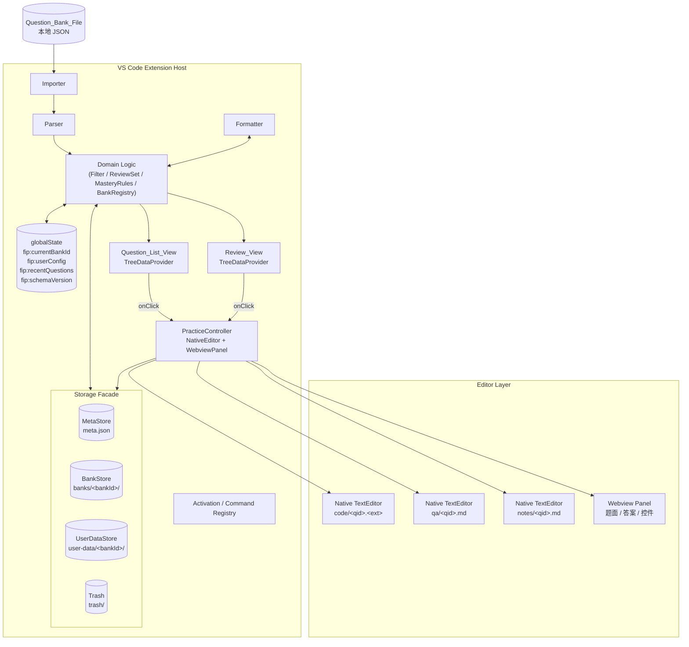
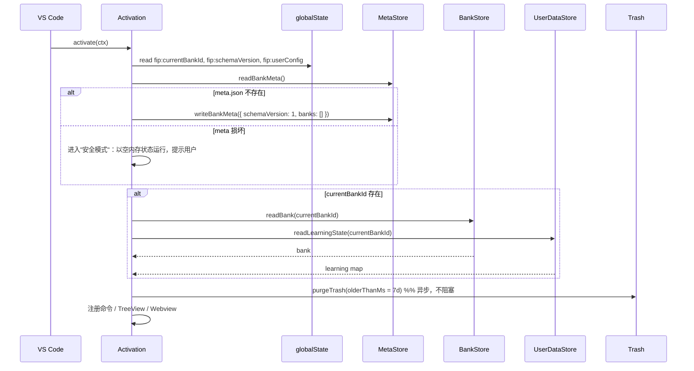
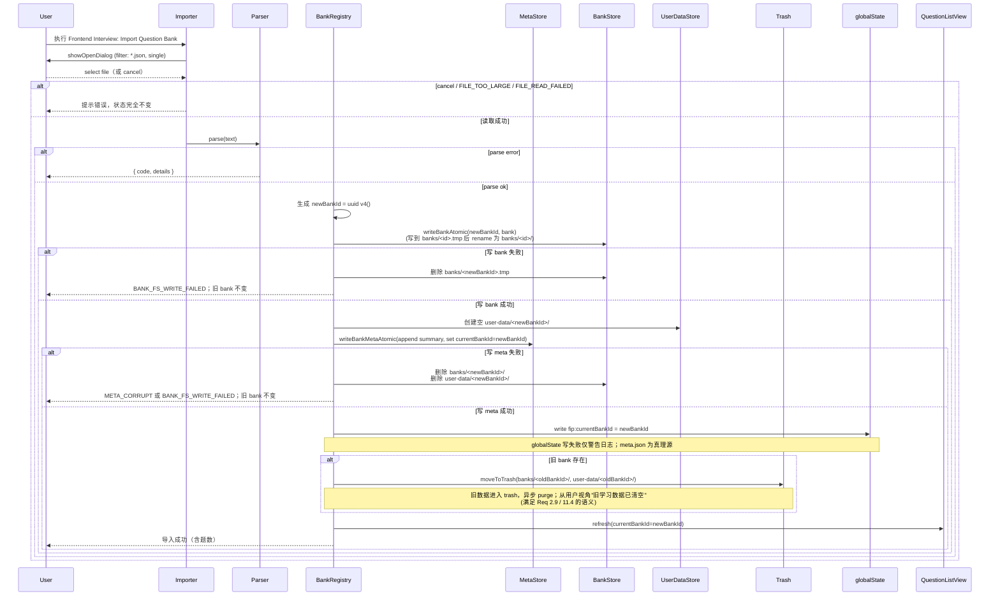
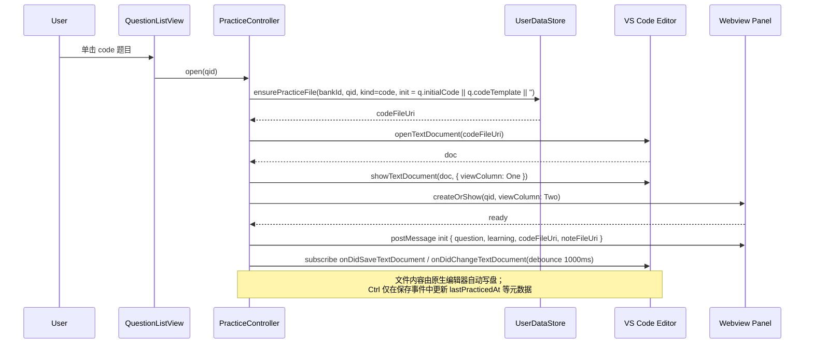

# Design Document

## Overview

`frontend-interview-practice` 是一个运行在 VS Code 内的扩展，目标是把"题库导入 → 浏览筛选 → 代码 / 问答练习 → 学习状态记录 → 专项复习"全流程闭环到编辑器内部。本文档基于已批准的 `requirements.md`，并在实现层做以下关键加强（与已批准需求兼容，不修改需求条目本身）：

- **存储分层**：`globalState` 仅承载小型元状态；题库本体、学习状态、代码 / 回答 / 笔记等长内容全部落到本地文件系统（`ExtensionContext.globalStorageUri`）。
- **多题库管理**：内存中维护多个 `Question_Bank` 元数据，用户可在多个题库间切换、移除；学习状态按 `bankId` 隔离。
- **覆盖导入安全切换**：覆盖式导入不再先删旧后写新，而是"先写新 → 原子切换 → 旧数据隔离到 trash → 异步清理"，任意中途失败旧数据完整可用。
- **代码题练习改用原生编辑器**：长文本输入（代码、QA 我的回答、Note）一律使用 VS Code 原生 `TextEditor`；Webview 仅承载题面、答案、控件、按钮、Markdown 预览等只读 / 控件类内容。
- **题型差异化字段**：`Question` 模型在保留原 `answer` 字段（向后兼容）基础上，扩展为基于 `type` 的 discriminated union，代码题与问答题各自暴露独立字段（如 `referenceCode` / `testCases` / `solutionExplanation`，或 `briefAnswer` / `detailedAnswer` / `keywords` / `followUps`）。

> 关于 **需求兼容性**：requirements.md 中的 `Question.answer` 等字段在新模型中以 *legacy 字段* 形式继续存在并被解析；新增字段（`referenceCode` 等）作为更细粒度的可选字段补充。任何既有 JSON 题库都仍然可被解析且解析-序列化往返一致，已批准需求条目（特别是 Req 1.1 / 1.8 / 1.9）继续成立。

### 设计目标

- **可预测的题库格式**：通过 `Question_Bank_Schema` 与 `Parser` / `Formatter` 的解析-序列化往返一致性，保证题库在外部存储与内部表示之间无损往返。
- **关注点分离**：Importer / Parser / Formatter / Storage 子层 / Filter / View 各自职责单一；`Storage` 进一步拆分为 `MetaStore` / `BankStore` / `UserDataStore` / `Trash` 四个子模块，外部以一个高层 `Storage` Facade 暴露。
- **学习状态可恢复**：所有 `Learning_State` 数据按 `bankId` 持久化在文件系统；跨会话 / 跨工作区可恢复。
- **错误可回滚 & 数据安全**：所有写入采用"写临时文件 → rename 替换"的原子模式；覆盖导入采用"先写新 → 切元数据 → 旧数据进 trash → 异步 purge"的两阶段流程；任何写入失败都不破坏可见状态。
- **可观测的本地文件布局**：用户、运维与未来迁移脚本都可以基于 `globalStorageUri` 下的目录结构离线查看 / 修复 / 备份数据。

### 技术选型与理由

| 维度 | 选型 | 理由 |
|------|------|------|
| 语言 | TypeScript（strict） | 与 VS Code Extension API 原生契合；discriminated union 天然适配 `Question` 模型。 |
| 运行时 | VS Code Extension Host (Node) | 满足"在 VS Code 内完成全流程"的核心约束。 |
| Schema 校验 | Ajv（JSON Schema 2020-12，启用 `oneOf` / `if-then-else`） | 成熟、性能足够支撑 5MB / 1 万题；输出结构化的 `字段路径 + 错误类型`，满足 Req 1.4-1.6 与按题型差异化字段的校验需要。 |
| 元状态存储 | `ExtensionContext.globalState` | 仅承载小型元状态（当前 bankId、用户偏好、最近列表、schema 版本）。 |
| 大体量存储 | `ExtensionContext.globalStorageUri` + `vscode.workspace.fs` | VS Code 原生为扩展提供的可写本地目录，跨平台、Code-Server 兼容；可拆分文件、原子重命名、便于备份与离线诊断。 |
| 列表视图 | `TreeDataProvider` + `TreeView` | 原生支持图标 / 描述 / 上下文菜单 / 筛选 UI 入口。 |
| 代码编辑 | VS Code 原生 `TextEditor`（`vscode.workspace.openTextDocument` + `showTextDocument`） | 直接复用 VS Code 完整编辑能力（高亮、智能补全、键位、版本控制集成），避免 Webview 内 `<textarea>` 的所有缺陷。 |
| Webview | Webview Panel + 纯 HTML / CSS + 少量 vanilla TS | 题面 / 答案 / 控件渲染对交互复杂度要求低；不需要引入 React。 |
| Markdown 渲染 | VS Code `markdown.showPreview` 命令 / Webview 内 markdown-it | 题面、参考答案、笔记预览统一基于 markdown。 |
| 测试框架 | `vitest` + `fast-check`（PBT）+ `@vscode/test-electron`（集成）+ `memfs`（FS 桩） | `vitest` + `fast-check` 覆盖纯函数与 `LocalFileStorage` 的 PBT；`memfs` 提供可重放的内存 FS；`@vscode/test-electron` 用于 Activation / TreeView / 原生编辑器集成冒烟。 |

## Architecture

### 系统分层



### 模块划分与职责

| 模块 | 类别 | 关键职责 | 关键依赖 |
|------|------|---------|---------|
| `Activation` | 入口 | 注册命令 / 视图容器 / TreeView / 上下文变量；启动时读 globalState + meta.json，按 `currentBankId` 加载激活 bank；异步触发 `Trash.purge(7d)` | VS Code API |
| `Importer` | I/O | 弹出文件选择对话框、读取 ≤10MB 文件、错误前置校验、调用 Parser 并把结果交给 `BankRegistry` 安全切换 | `vscode.window.showOpenDialog`, `vscode.workspace.fs` |
| `Parser` | 纯函数 | JSON 解析 / Schema 校验（含 discriminated union） / `id` 去重 / 空题库判断 / 错误对象构造；兼容 legacy `answer` 字段 | Ajv |
| `Formatter` | 纯函数 | `Question_Bank` → JSON 文本（与 Parser 反向），按 `type` 序列化 union 子类型字段，无字段丢失 | 无 |
| `MetaStore` | I/O | 读写 `meta.json`（`bankId` 列表、当前激活 bank、bank 摘要）；原子写入 | `vscode.workspace.fs` |
| `BankStore` | I/O | 读写 `banks/<bankId>/bank.json` 与 `schema-version`；原子写入；不变内容 | `vscode.workspace.fs` |
| `UserDataStore` | I/O | 读写 `user-data/<bankId>/learning.json`；维护 in-memory cache + 串行化写队列；读写 `code/<qid>.<ext>` / `qa/<qid>.md` / `notes/<qid>.md` 文件 | `vscode.workspace.fs` |
| `Trash` | I/O | 把目录移到 `trash/<bankId>-<ts>/`；按时间窗口异步 purge | `vscode.workspace.fs` |
| `Storage` (Facade) | I/O | 对外暴露统一接口；编排上述四子层；提供"写新 → 切元 → 旧入 trash"的覆盖切换事务 | 上述四子层 |
| `BankRegistry` | 纯函数 + I/O | 维护 `BankSummary[]` 内存视图；切换 / 移除 bank；同步 globalState `currentBankId` | `Storage` |
| `Filter` | 纯函数 | 四维筛选谓词、维度激活 / 取值切换、组合规则 | 无 |
| `MasteryRules` | 纯函数 | `Mastery_Status ↔ Wrong_Flag` 联动 | 无 |
| `ReviewSetBuilder` | 纯函数 | 构造三类 `Review_Set`、保持 `Question_Bank` 原序、对结果做一次性快照 | 无 |
| `QuestionListView` | View | TreeView 渲染、列表项视觉标识（收藏 / 掌握状态）、当前激活 bank 标题 / 切换按钮 | VS Code TreeView API |
| `ReviewView` | View | TreeView 渲染、三个复习入口、复习模式快照（按 `bankId` 隔离） | VS Code TreeView API |
| `PracticeController` | View | 同时编排 **原生编辑器** 与 **Webview Panel**：把代码 / QA 回答 / 笔记打开在原生编辑器，把题面 / 答案 / 控件渲染到 Webview；监听 `onDidSaveTextDocument` / `onDidChangeTextDocument` 触发学习状态更新；管理生命周期与订阅清理 | VS Code Editor + Webview API |

### 启动 / 激活流程



### 导入题库（安全切换）



> **Req 2.9 / 11.4 实现说明**：从用户视角看，覆盖导入"删除旧 bank 的 LearningState / 代码 / QA 回答"语义不变；实现上由 `Trash.moveToTrash` + 后台 `purgeTrash` 完成。一旦 meta.json 切换并 fsync 成功，旧 bank 与其 user-data 在所有读路径上都不再可见，等价于"已删除"。

### 打开代码题（原生编辑器 + Webview 双视图）



## Components and Interfaces

### Activation 入口

```ts
export async function activate(ctx: vscode.ExtensionContext): Promise<void> {
  const storage = await Storage.create(ctx);
  const state = await storage.bootstrap(); // 加载失败时返回空状态并提示，不删除底层数据 (Req 11.5)
  const filter = new FilterController();
  const registry = new BankRegistry(storage, ctx.globalState);
  const listProvider = new QuestionListProvider(state, filter, registry);
  const reviewProvider = new ReviewProvider(state, registry);
  const practice = new PracticeController(ctx, storage, state);

  // 异步清理 trash，不阻塞激活
  void storage.trash.purge({ olderThanMs: 7 * 24 * 3600 * 1000 });

  ctx.subscriptions.push(
    vscode.commands.registerCommand('frontendInterview.import',
      () => importBank(ctx, storage, registry, state, listProvider)),
    vscode.commands.registerCommand('frontendInterview.openQuestion',
      (qid: string) => practice.open(qid)),
    vscode.commands.registerCommand('frontendInterview.switchBank',
      () => switchBankFlow(registry, state, listProvider)),
    vscode.commands.registerCommand('frontendInterview.removeBank',
      () => removeBankFlow(registry, state, listProvider)),
    vscode.commands.registerCommand('frontendInterview.review.unmastered',
      () => reviewProvider.enter('unmastered')),
    vscode.commands.registerCommand('frontendInterview.review.favorite',
      () => reviewProvider.enter('favorite')),
    vscode.commands.registerCommand('frontendInterview.review.wrong',
      () => reviewProvider.enter('wrong')),
    vscode.window.registerTreeDataProvider('frontendInterview.questionList', listProvider),
    vscode.window.registerTreeDataProvider('frontendInterview.review', reviewProvider),
  );
}
```

### Parser / Formatter

```ts
// 纯函数，不依赖 vscode 模块
export function parse(text: string): Result<QuestionBank, ParseError>;
export function format(bank: QuestionBank): string;

export type ParseError =
  | { code: 'INVALID_JSON';            line: number; column: number; message: string }
  | { code: 'SCHEMA_VIOLATION';        violations: SchemaViolation[] }
  | { code: 'DUPLICATE_QUESTION_ID';   duplicates: { id: string; indices: number[] }[] }
  | { code: 'EMPTY_QUESTION_BANK' };

export interface SchemaViolation {
  path: string;          // e.g. "questions[3].referenceCode"
  kind: 'missing' | 'type_mismatch' | 'enum_violation' | 'oneOf_mismatch';
  questionId?: string;   // 当能定位到具体 Question 时填充
  questionType?: 'code' | 'qa'; // 用于按 type 不匹配的字段提示
}
```

`Parser` 在校验通过后做以下后处理（保持 Req 1.1 / 1.8 / 1.9 兼容）：

1. 按 `type` 分发到 `CodeQuestion` / `QAQuestion` 子类型；
2. 若 `referenceCode` 缺失而 `answer` 存在（legacy），把 `answer` 同时映射为 `referenceCode`；
3. 若 `briefAnswer` 缺失而 `answer` 存在（legacy），把 `answer` 同时映射为 `briefAnswer`；
4. `Formatter` 在序列化时同样保持 `answer` 与子类型字段共存，保证 round-trip 完备。

### Storage Facade 与子层

```ts
export class Storage {
  constructor(
    public readonly meta: MetaStore,
    public readonly banks: BankStore,
    public readonly userData: UserDataStore,
    public readonly trash: Trash,
  ) {}
  static async create(ctx: vscode.ExtensionContext): Promise<Storage>;

  // 高层事务（编排子层 + globalState）
  async bootstrap(): Promise<InMemoryState>;                            // Req 11.2 / 11.5
  async installBank(bank: QuestionBank, source?: BankSource): Promise<BankSummary>; // 安全切换流程的事务封装
  async removeBank(bankId: string): Promise<void>;                      // moveToTrash + meta 更新
}

export interface MetaStore {
  read(): Promise<BankMeta>;
  writeAtomic(next: BankMeta): Promise<void>; // 写 meta.json.tmp → rename
}

export interface BankStore {
  readBank(bankId: string): Promise<QuestionBank>;
  writeBankAtomic(bankId: string, bank: QuestionBank): Promise<void>;   // 写到 banks/<id>.tmp 再 rename
  bankExists(bankId: string): Promise<boolean>;
  deleteBank(bankId: string): Promise<void>;                            // 不走 trash，仅用于清理新 bank tmp
}

export interface UserDataStore {
  readLearningState(bankId: string, qid: string): Promise<LearningState | undefined>;
  writeLearningState(bankId: string, qid: string, next: LearningState): Promise<void>;
  readLearningMap(bankId: string): Promise<Map<string, LearningState>>;
  ensurePracticeFile(bankId: string, qid: string, kind: PracticeKind, ext: string, init: string): Promise<vscode.Uri>;
  readPracticeContent(bankId: string, qid: string, kind: PracticeKind, ext: string): Promise<string | undefined>;
  writePracticeContent(bankId: string, qid: string, kind: PracticeKind, ext: string, value: string): Promise<void>;
  readNote(bankId: string, qid: string): Promise<string | undefined>;
  writeNote(bankId: string, qid: string, value: string): Promise<void>;
  ensureBankRoot(bankId: string): Promise<void>;
}

export interface Trash {
  moveToTrash(uris: vscode.Uri[], reason: { bankId: string }): Promise<void>;
  purge(opts: { olderThanMs: number }): Promise<void>;
}

export type PracticeKind = 'code' | 'qa' | 'note';
```

#### 写入原子性约束

- **JSON 文件**：写入 `<file>.tmp` 后通过 `vscode.workspace.fs.rename` 替换原文件。`rename` 在大多数 OS 上为原子操作；同分区 rename 失败时回退为 `copy + delete` 并标记 `META_CORRUPT` 风险。
- **目录替换**：先写到 `<dir>.tmp/`，全部子文件落盘后整目录 `rename` 为最终路径。
- **`learning.json` 合并写入**：采用 in-memory cache + 串行化写队列：
  - 进程内维护 `LearningCache: Map<bankId, Map<qid, LearningState>>`；
  - 写操作进入按 `bankId` 串行的队列，每次 dequeue 时把整 cache 序列化为 `learning.json.tmp` 并 rename；
  - 多次 1000ms debounce 内的写合并为一次 fs 写入，避免高频 IO。
- **UTF-8**：所有 JSON 与 markdown 文件使用 UTF-8 编码。

### BankRegistry

```ts
export class BankRegistry {
  constructor(private storage: Storage, private gs: vscode.Memento) {}

  list(): BankSummary[];
  current(): BankSummary | undefined;
  async switchTo(bankId: string): Promise<void>;       // 更新 meta.currentBankId + globalState
  async install(bank: QuestionBank, src?: BankSource): Promise<BankSummary>; // 安全切换
  async remove(bankId: string): Promise<void>;         // moveToTrash
  isLegacyDuplicate(bank: QuestionBank): boolean;       // 同名 + 同 version 提示，但允许导入（不同 bankId）
}
```

### Filter

```ts
export interface FilterState {
  type?: 'code' | 'qa';
  category?: string;
  tags?: ReadonlySet<string>;   // size ∈ [1, 50]
  difficulty?: 'easy' | 'medium' | 'hard';
}

export function applyFilter(questions: readonly Question[], f: FilterState): Question[];
export function isActive(f: FilterState, dim: keyof FilterState): boolean;
export function clearDimension(f: FilterState, dim: keyof FilterState): FilterState;
```

`applyFilter` 实现为四个独立谓词的逻辑与，未激活维度恒返回 `true`（Req 4.1-4.8）。`Filter` 与 `bankId` 解耦：列表视图先按 `currentBankId` 取题，再交给 `Filter`。

### ReviewSetBuilder

```ts
export type ReviewKind = 'unmastered' | 'favorite' | 'wrong';

export function buildReviewSet(
  questions: readonly Question[],
  learning: ReadonlyMap<string, LearningState>,
  kind: ReviewKind,
): Question[]; // 保留 questions 原序，且每个 q 至多出现一次
```

切换 `bankId` 时，复习快照失效，`ReviewView` 重新构造（Req 10.6 在多库场景下的自然延伸）。

### MasteryRules

```ts
export function deriveLearningState(prev: LearningState, next: MasteryStatus): LearningState {
  let wrongFlag = prev.wrongFlag;
  if (next === 'not_mastered') wrongFlag = true;   // Req 9.3
  if (next === 'mastered')     wrongFlag = false;  // Req 9.4
  return { ...prev, mastery: next, wrongFlag };
}
```

### PracticeController

负责把单道题目同时呈现为 **原生编辑器（长文本编辑）** 与 **Webview Panel（题面 / 答案 / 控件 / 预览）** 两部分，并维护它们之间的双向同步。

```ts
class PracticeController {
  constructor(ctx: vscode.ExtensionContext, storage: Storage, state: InMemoryState) {}

  /** 打开一道题目：原生编辑器 + Webview Panel 双视图 */
  open(qid: string): Promise<void>;

  /** 关闭某题目相关的所有视图与订阅 */
  close(qid: string): Promise<void>;

  /** 内部：根据 type 路由 */
  private openCode(q: CodeQuestion): Promise<void>;
  private openQA(q: QAQuestion): Promise<void>;

  /** 内部：创建或聚焦 Webview Panel（ViewColumn.Two） */
  private createOrShowWebview(qid: string, q: Question): vscode.WebviewPanel;

  /** 内部：消息路由 */
  private onWebviewMessage(qid: string, msg: WebviewToHostMessage): Promise<void>;

  /** 内部：监听原生编辑器保存 / 变更事件，更新 LearningState 元数据（如 lastPracticedAt） */
  private subscribeEditor(qid: string, doc: vscode.TextDocument): vscode.Disposable;

  /** 内部：debounce util */
  private debounce(qid: string, kind: 'noteMeta' | 'practiceMeta', fn: () => void): void;
}
```

#### 视图布局

```
┌──────────────────────────────────────────────┐
│ Editor Group 1 (ViewColumn.One)              │
│   <qid>.<ext> (原生 TextEditor)              │  代码题：用户写代码
│                                               │  QA 题：用户写"我的回答"
├──────────────────────────────────────────────┤
│ Editor Group 2 (ViewColumn.Two)              │
│   Webview Panel                              │
│     - 题面（markdown 渲染）                    │
│     - 查看答案 / 答案区（代码题：referenceCode  │
│       + solutionExplanation；QA：briefAnswer  │
│       / detailedAnswer / followUps）         │
│     - 测试用例展示（代码题）                    │
│     - 收藏切换 / Mastery 控件                 │
│     - 笔记入口（链接：在原生编辑器打开           │
│       notes/<qid>.md；以及 markdown 预览按钮）│
└──────────────────────────────────────────────┘
```

#### 自动保存策略（重写）

| 长文本类型 | 编辑载体 | 保存机制 |
|-----------|---------|---------|
| 代码（CodeQuestion） | 原生 TextEditor → `code/<qid>.<ext>` | 文件由 VS Code 保存（含 `Files: Auto Save` 设置 / 用户 `Cmd+S`）；`PracticeController` 监听 `onDidSaveTextDocument` / `onDidChangeTextDocument`（1000ms debounce）更新 `LearningState.lastPracticedAt` 等元数据 |
| QA 我的回答（QAQuestion） | 原生 TextEditor → `qa/<qid>.md` | 同上，统一为"原生编辑器自动写盘 + 元数据 debounce 更新" |
| Note | 原生 TextEditor → `notes/<qid>.md` | 同上 |
| Mastery / Favorite 等控件状态 | Webview 控件 | Webview 通过 `postMessage` 触发，由 `PracticeController` 写入 `learning.json` 并回传 ack |

> 选择文件系统驱动的理由：① 原生编辑器自动落盘已是 VS Code 用户期待的语义（与他们写代码的方式一致）；② Webview 不需要重复实现 debounce 与失败回滚；③ 代码 / 笔记内容的"已保存"指示直接复用 VS Code 编辑器 dirty 状态。

#### 失败回滚（Req 5.7 / 6.8 / 7.5 / 8.3 / 9.7）

- **元数据写入失败**（更新 `LearningState`）：保留内存值不变；Webview 收到 `rollback` 消息把控件状态拉回上次稳定值；弹出错误提示。
- **practice 文件自动写盘失败**：原生编辑器自身会保留 dirty 状态；`PracticeController` 在收到 `onDidSaveTextDocument` 之前不更新 `lastPracticedAt`；用户可重试 `Cmd+S`。

### Webview ↔ Extension Host 消息协议（重写）

#### Host → Webview

```ts
type HostToWebviewMessage =
  | { type: 'init'; payload: {
        bankId: string;
        question: Question;                // discriminated union
        learning: LearningState;
        codeFileUri?: string;              // CodeQuestion 时存在；webview 可用 command:vscode.open?<uri> 打开
        qaFileUri?: string;                // QAQuestion 时存在
        noteFileUri: string;               // 所有题型都有
      } }
  | { type: 'showAnswer'; payload: AnswerPayload }
  | { type: 'rollback'; payload: Partial<LearningState> }
  | { type: 'refreshLearning'; payload: LearningState }
  | { type: 'masteryAck'; ok: boolean; reason?: string }
  | { type: 'favoriteAck'; ok: boolean; reason?: string };

type AnswerPayload =
  | { type: 'code'; referenceCode?: string; solutionExplanation?: string; testCases?: TestCase[]; legacyAnswer?: string }
  | { type: 'qa';   briefAnswer?: string; detailedAnswer?: string; followUps?: FollowUp[]; legacyAnswer?: string };
```

#### Webview → Host

```ts
type WebviewToHostMessage =
  | { type: 'ready' }                             // Webview DOM 就绪，请求 init
  | { type: 'requestAnswer' }                     // 触发"查看答案"
  | { type: 'toggleFavorite' }
  | { type: 'setMastery'; value: MasteryStatus }
  | { type: 'openNativeEditor'; target: 'code' | 'qa' | 'note' } // 主动让 host 在主编辑列重新打开文件
  | { type: 'requestNotePreview' };               // 请求 host 触发 markdown.showPreview

// 注意：autosave: 'code' / 'qa' / 'note' 已被移除——长文本由原生编辑器写盘
```

> 控件类操作（Mastery / Favorite）依然走 Webview → Host postMessage，因为它们是结构化数据，不适合落到独立文本文件。

## Data Models

### TypeScript 类型定义

#### Question（discriminated union，按 `type` 区分字段）

```ts
export type QuestionType  = 'code' | 'qa';
export type Difficulty    = 'easy' | 'medium' | 'hard';
export type MasteryStatus = 'unlearned' | 'learning' | 'mastered' | 'not_mastered';

export interface QuestionBase {
  id: string;                  // 1-100 chars，区分大小写唯一
  type: QuestionType;
  title: string;               // 1-200 chars
  content: string;             // ≤20000 chars，markdown
  category: string;            // 1-100 chars
  tags: string[];              // 0-50 elements
  difficulty: Difficulty;

  /** Legacy 兼容字段（Req 1.1）：已批准需求要求 `answer` 必填；新模型保留 */
  answer: string;              // ≤50000 chars
}

export interface CodeQuestion extends QuestionBase {
  type: 'code';
  language?: string;                  // 1-50 chars，决定文件扩展名
  initialCode?: string;               // 等价于原 codeTemplate，新名更直观
  codeTemplate?: string;              // 旧字段名 alias（向后兼容；与 initialCode 同时存在时以 initialCode 为准）
  referenceCode?: string;             // 参考代码；缺省时用 legacy `answer` 兜底
  testCases?: Array<{
    name?: string;
    input?: string;
    expected?: string;
    description?: string;             // markdown
  }>;
  solutionExplanation?: string;       // 解题思路 markdown
}

export interface QAQuestion extends QuestionBase {
  type: 'qa';
  keywords?: string[];                // 关键词（用于答题点检查 / 提示）
  briefAnswer?: string;               // 简洁答案；缺省时用 legacy `answer` 兜底
  detailedAnswer?: string;            // 详细答案 markdown
  followUps?: Array<{
    question: string;
    answer?: string;                  // markdown
  }>;
}

export type Question = CodeQuestion | QAQuestion;

export interface QuestionBank {
  name: string;                       // 1-100 chars
  version: string;                    // 1-20 chars
  questions: Question[];              // length ≥ 1，否则 EMPTY_QUESTION_BANK
}
```

#### LearningState

```ts
export interface LearningState {
  mastery: MasteryStatus;             // 默认 unlearned
  favoriteFlag: boolean;              // 默认 false
  wrongFlag: boolean;                 // 默认 false
  hasNote: boolean;                   // 不再把 note 文本放在 learning.json，仅记标志位（实际文本在 notes/<qid>.md）
  lastPracticedAt?: number;           // epoch ms
}
```

> 把 `note` 文本从 `learning.json` 抽离到独立 `notes/<qid>.md`，使笔记可以单文件备份、走 git diff、走 markdown 预览，也避免 `learning.json` 因长笔记膨胀。`learning.json` 保留 `hasNote` 标志位，便于 TreeView 不读取每个文件就能展示"有无笔记"图标。Req 7.1-7.5 在新设计下的语义保持不变。

#### Bank 元数据

```ts
export interface BankMeta {
  schemaVersion: 1;
  currentBankId?: string;
  banks: BankSummary[];
}

export interface BankSummary {
  id: string;                         // 内部生成的 UUID v4，导入时分配
  name: string;
  version: string;
  questionCount: number;
  importedAt: number;                 // epoch ms
  source?: { fileName?: string };
}

export interface BankSource {
  fileName?: string;                  // 用户原始文件名（仅展示用）
  filePath?: string;                  // 仅记录展示，不作为内部寻址
}
```

`BankMeta` 示例：

```json
{
  "schemaVersion": 1,
  "currentBankId": "5e1a7f5a-1b34-4c2c-8e9b-3f8b9a2a7b41",
  "banks": [
    {
      "id": "5e1a7f5a-1b34-4c2c-8e9b-3f8b9a2a7b41",
      "name": "高频前端面试题",
      "version": "1.2.0",
      "questionCount": 257,
      "importedAt": 1724918400000,
      "source": { "fileName": "frontend-2024.json" }
    }
  ]
}
```

#### globalState 键空间（仅小型元状态）

| Key | 类型 | 说明 |
|------|------|------|
| `fip:currentBankId` | `string \| undefined` | 当前激活题库 ID；`meta.json` 为真理源，本键为快速读取镜像 |
| `fip:userConfig` | `UserConfig` | 用户偏好（自动保存延迟、列表排序、Webview 字号等） |
| `fip:recentQuestions` | `string[]` | 最近打开题目 ID 队列（FIFO，长度上限 50） |
| `fip:schemaVersion` | `1` | Storage 物理布局版本号，便于将来迁移 |

> globalState 只承载这些小对象，避免历史问题（题库本体写到 globalState 导致启动慢、备份难、迁移难、超过单 key 限制）。

#### 文件系统布局

```
<globalStorageUri>/
├── meta.json                     # BankMeta
├── meta.json.tmp                 # 写入中的临时文件，启动时若残留视为未完成写入并删除
├── banks/
│   ├── <bankId>/
│   │   ├── bank.json             # QuestionBank（题面、参考答案等不变内容）
│   │   └── schema-version        # 单库结构版本号（纯文本，例如 "1"）
│   └── <bankId>.tmp/             # 安全切换流程中的临时目录
├── user-data/
│   └── <bankId>/
│       ├── learning.json         # { [qid]: LearningState }
│       ├── code/
│       │   └── <qid>.<ext>       # 代码题练习文件（扩展名映射见下）
│       ├── qa/
│       │   └── <qid>.md          # QA 我的回答
│       └── notes/
│           └── <qid>.md          # 用户笔记
└── trash/
    └── <bankId>-<timestamp>/...  # 覆盖 / 移除时的隔离区
```

#### `language` → 文件扩展名映射

| `Question.language`（小写） | 文件扩展名 |
|---|---|
| `javascript`, `js` | `.js` |
| `typescript`, `ts` | `.ts` |
| `jsx` | `.jsx` |
| `tsx` | `.tsx` |
| `python`, `py` | `.py` |
| `java` | `.java` |
| `go` | `.go` |
| `rust`, `rs` | `.rs` |
| `c`, `cpp`, `c++` | `.c` / `.cpp` |
| `html` | `.html` |
| `css` | `.css` |
| `json` | `.json` |
| 缺省 / 未识别 | `.txt` |

映射表在 `practiceFiles.ts` 中以纯函数 `extForLanguage(lang?: string): string` 暴露，便于单元测试。

#### Question_Bank_Schema（JSON Schema 2020-12，按 `type` 差异化）

```json
{
  "$schema": "https://json-schema.org/draft/2020-12/schema",
  "$id": "https://kiro.dev/schemas/frontend-interview-practice/question-bank.json",
  "title": "QuestionBank",
  "type": "object",
  "additionalProperties": false,
  "required": ["name", "version", "questions"],
  "properties": {
    "name":     { "type": "string", "minLength": 1, "maxLength": 100 },
    "version":  { "type": "string", "minLength": 1, "maxLength": 20 },
    "questions": {
      "type": "array",
      "minItems": 1,
      "maxItems": 10000,
      "items": { "$ref": "#/$defs/Question" }
    }
  },
  "$defs": {
    "QuestionBase": {
      "type": "object",
      "required": ["id", "type", "title", "content", "category", "tags", "difficulty", "answer"],
      "properties": {
        "id":         { "type": "string", "minLength": 1, "maxLength": 100 },
        "type":       { "type": "string", "enum": ["code", "qa"] },
        "title":      { "type": "string", "minLength": 1, "maxLength": 200 },
        "content":    { "type": "string", "maxLength": 20000 },
        "category":   { "type": "string", "minLength": 1, "maxLength": 100 },
        "tags": {
          "type": "array",
          "minItems": 0,
          "maxItems": 50,
          "items": { "type": "string", "minLength": 1, "maxLength": 50 }
        },
        "difficulty": { "type": "string", "enum": ["easy", "medium", "hard"] },
        "answer":     { "type": "string", "maxLength": 50000 }
      }
    },
    "Question": {
      "allOf": [
        { "$ref": "#/$defs/QuestionBase" },
        {
          "oneOf": [
            { "$ref": "#/$defs/CodeQuestionExtras" },
            { "$ref": "#/$defs/QAQuestionExtras" }
          ]
        },
        {
          "if":   { "properties": { "type": { "const": "code" } } },
          "then": { "$ref": "#/$defs/CodeQuestionExtras" }
        },
        {
          "if":   { "properties": { "type": { "const": "qa" } } },
          "then": { "$ref": "#/$defs/QAQuestionExtras" }
        }
      ],
      "unevaluatedProperties": false
    },
    "CodeQuestionExtras": {
      "type": "object",
      "properties": {
        "type":            { "const": "code" },
        "language":        { "type": "string", "minLength": 1, "maxLength": 50 },
        "initialCode":     { "type": "string", "maxLength": 50000 },
        "codeTemplate":    { "type": "string", "maxLength": 50000 },
        "referenceCode":   { "type": "string", "maxLength": 50000 },
        "testCases": {
          "type": "array",
          "maxItems": 100,
          "items": {
            "type": "object",
            "additionalProperties": false,
            "properties": {
              "name":        { "type": "string", "maxLength": 100 },
              "input":       { "type": "string", "maxLength": 5000 },
              "expected":    { "type": "string", "maxLength": 5000 },
              "description": { "type": "string", "maxLength": 5000 }
            }
          }
        },
        "solutionExplanation": { "type": "string", "maxLength": 50000 }
      }
    },
    "QAQuestionExtras": {
      "type": "object",
      "properties": {
        "type":           { "const": "qa" },
        "keywords":       { "type": "array", "maxItems": 50, "items": { "type": "string", "minLength": 1, "maxLength": 100 } },
        "briefAnswer":    { "type": "string", "maxLength": 5000 },
        "detailedAnswer": { "type": "string", "maxLength": 50000 },
        "followUps": {
          "type": "array",
          "maxItems": 50,
          "items": {
            "type": "object",
            "additionalProperties": false,
            "required": ["question"],
            "properties": {
              "question": { "type": "string", "minLength": 1, "maxLength": 1000 },
              "answer":   { "type": "string", "maxLength": 20000 }
            }
          }
        }
      }
    }
  }
}
```

> Schema 中 `minItems: 1` 仅作快速失败辅助；真正的 `EMPTY_QUESTION_BANK` 错误由 `Parser` 在校验通过后单独显式抛出（Req 1.10）。`unevaluatedProperties: false` 配合 `if/then/else` 让按题型不允许的字段（例如 code 题里出现 `briefAnswer`）触发 `oneOf_mismatch` / `additionalProperties` 类错误，并在 `SchemaViolation.questionType` 中标注。

### Storage 写入失败语义

所有写操作语义为"先在内存修改 → 通过子层写入文件系统（原子 rename）→ 失败时抛出受控异常并回滚内存值"。`Storage.installBank` 是更高层事务，失败时按"安全切换"流程定义的步骤逐级回滚。


## Correctness Properties

*A property is a characteristic or behavior that should hold true across all valid executions of a system-essentially, a formal statement about what the system should do. Properties serve as the bridge between human-readable specifications and machine-verifiable correctness guarantees.*

本特性中以下模块是 PBT 的最佳应用场景：`Parser` / `Formatter`（解析器 + discriminated union）、`Filter`（纯谓词组合）、`MasteryRules`（状态机）、`ReviewSetBuilder`（基于谓词的子集构造）、`LocalFileStorage`（多文件原子写 + 多 bank 隔离 + 安全切换）。视图渲染、命令注册、文件对话框等会作为 EXAMPLE / SMOKE / EDGE_CASE 单独覆盖（详见 Testing Strategy）。

### Property 1: Parser-Formatter 解析-序列化往返一致（含 discriminated union）

*For any* 由 `Parser` 成功解析得到的合法 `Question_Bank` 对象 B，`Parser(Formatter(B))` 与 B 在字段集与字段值上完全相等；并且对于 B 中任意 `CodeQuestion` 子类型字段（`language` / `initialCode` / `codeTemplate` / `referenceCode` / `testCases` / `solutionExplanation`）与 `QAQuestion` 子类型字段（`keywords` / `briefAnswer` / `detailedAnswer` / `followUps`），round-trip 后的 `type` 与子类型字段集合保持一致；`Formatter(B)` 输出的文本能被同一个 `Question_Bank_Schema` 校验通过。

**Validates: Requirements 1.8, 1.9**

### Property 2: Schema 违规可被完整检出（含按题型不允许的字段）

*For any* 合法的 `Question_Bank` 对象 B，对其执行单步"突变"——删除任一必填字段、把任一必填字段替换为类型不匹配的值、把 `type` 替换为 `{code, qa}` 之外的字符串、把 `difficulty` 替换为 `{easy, medium, hard}` 之外的字符串、把仅属于 `code` 的字段（如 `referenceCode`）放进 `qa` 题或反之——`Parser` 在解析突变后的 JSON 文本时都应返回 `SCHEMA_VIOLATION` 错误，且 `violations` 中至少包含描述该突变的 `path` 与 `kind`；`type` / `difficulty` / 跨子类型字段的 violation 还应携带对应 `Question.id` 与 `questionType`。

**Validates: Requirements 1.4, 1.5, 1.6**

### Property 3: 重复 id 全量定位

*For any* 合法的 `Question_Bank` 对象 B 和任意非空"重复方案" R（一组 (id, indices) 对），将 B 的部分题目按 R 复制成相同 id 后构造的 JSON 文本，`Parser` 都应返回 `DUPLICATE_QUESTION_ID` 错误，且 `duplicates` 中每个 id 的 indices 集合等于该 id 在 `questions` 数组中实际出现位置的集合（基于 0）。

**Validates: Requirements 1.7**

### Property 4: Filter 维度语义、单位元

*For any* 题目列表 Q 和 `FilterState` f：`applyFilter(Q, f)` 的输出 R 满足"已激活维度的逐维度逻辑与"——
- 若 `f.type` 已激活，则 ∀q∈R, q.type === f.type；
- 若 `f.category` 已激活，则 ∀q∈R, q.category === f.category（区分大小写）；
- 若 `f.tags` 已激活，则 ∀q∈R, q.tags 与 f.tags 交集非空；
- 若 `f.difficulty` 已激活，则 ∀q∈R, q.difficulty === f.difficulty；
- 任何 q∈Q 若同时满足上述全部已激活维度，则 q∈R（完备性）。

并且 `applyFilter(Q, {}) = Q`（空 Filter 是单位元）。

> 注：`mergeFilter(f1, f2)` 仅是一个 FilterState 合并函数，按"later-wins"语义定义——在每个维度上，若 `f2` 在该维度有值则取 `f2`，否则回退到 `f1`。它本身不声明与 `applyFilter` 串接的等价关系；上层 UI 在多次调整筛选条件时通过 `mergeFilter` 将增量合入当前 `FilterState`，再用合并后的 state 去过滤题库。

**Validates: Requirements 4.2, 4.3, 4.4, 4.5, 4.6, 4.8**

### Property 5: clearDimension 局部性

*For any* `FilterState` f 与维度 d ∈ {type, category, tags, difficulty}，`clearDimension(f, d)` 满足：① d 维度变为未激活；② 其余三个维度的激活状态与取值与 f 完全一致。

**Validates: Requirements 4.7**

### Property 6: ReviewSet 谓词-保序-子集

*For any* 题目列表 Q、`Learning_State` 映射 L、复习类型 k ∈ {unmastered, favorite, wrong}，`buildReviewSet(Q, L, k)` 的输出 R 满足：① R 是 Q 的子序列（保留 Q 中的相对顺序）；② q∈R 当且仅当对应 `LearningState` 满足 k 的谓词（unmastered: mastery==='not_mastered'；favorite: favoriteFlag===true；wrong: wrongFlag===true）；③ R 中无重复。

**Validates: Requirements 10.2, 10.3, 10.4**

### Property 7: ReviewSet 快照不变性

*For any* `Q`、`L`、`k`，已经构造好的 `R = buildReviewSet(Q, L, k)` 序列在后续对 L 的任意修改 L' 下保持不变（值快照独立于后续修改）；并且 `buildReviewSet(Q, L', k)` 在 L' 中某 q 的 `mastery` 从满足谓词的取值变更为 `mastered` 时不再包含 q（k ∈ {unmastered, wrong}）。

**Validates: Requirements 10.6, 10.7**

### Property 8: MasteryRules 状态机不变量

*For any* 上一稳定 `LearningState` prev 与目标 `MasteryStatus` next，`deriveLearningState(prev, next)` 满足：① `mastery === next`；② 若 next === `not_mastered`，则 `wrongFlag === true`；③ 若 next === `mastered`，则 `wrongFlag === false`；④ 若 next ∈ {unlearned, learning}，则 `wrongFlag === prev.wrongFlag`；⑤ 其它字段（`favoriteFlag`、`hasNote`、`lastPracticedAt`）保持不变。

**Validates: Requirements 9.3, 9.4**

### Property 9: LocalFileStorage Round-Trip（多 bank 隔离）

*For any* `bankId`、`qid` 与 `LearningState` ls / 字符串 content c / 笔记 n：
- `userData.writeLearningState(bankId, qid, ls)` 后 `userData.readLearningState(bankId, qid)` 得到的值与 ls 在所有字段上相等；
- `userData.writePracticeContent(bankId, qid, kind, ext, c)` 后 `userData.readPracticeContent(bankId, qid, kind, ext) === c`；
- `userData.writeNote(bankId, qid, n)` 后 `userData.readNote(bankId, qid) === n`；
- `banks.writeBankAtomic(bankId, b)` 后 `banks.readBank(bankId) === b`（深度等价）；
- `Storage.bootstrap()` 在任意写入序列后返回的 `InMemoryState` 与逐条读取拼装出的状态等价。

并且对任意两个不同的 `bankId₁ ≠ bankId₂`，对 `bankId₁` 的任意写操作序列对 `userData.read*(bankId₂, *)` / `banks.readBank(bankId₂)` 的结果都不产生影响（多 bank 数据隔离）。

**Validates: Requirements 5.4, 6.4, 7.3, 9.2, 11.1, 11.2**

### Property 10: 写入失败回滚不变量（统一）

*For any* 触发任意写入操作（更新 `LearningState` 中的 `mastery` / `favoriteFlag` / `hasNote` / `lastPracticedAt`、写入 `practiceContent` 元数据、保存 `note` 元数据），当底层 `vscode.workspace.fs` 写入抛错时：① 内存中对应字段保持上次稳定值；② Webview 收到 `rollback` 消息且其控件状态被拉回上次稳定值；③ 用户被通过 `showErrorMessage` 提示；④ `learning.json` / 相关 practice 文件磁盘内容保持上次稳定状态（验证方式：再次 `read*` 得到与失败前完全相同的值）。

**Validates: Requirements 5.7, 6.8, 7.5, 8.3, 9.7**

### Property 11: 清空笔记等价于"删除"

*For any* `bankId` / `qid`，`userData.writeNote(bankId, qid, '')` 之后：① `userData.readNote(bankId, qid)` 返回 `''`（或 `undefined`，二者在 `Practice_View` 中等价为空编辑区）；② `learning.json` 中对应 `LearningState.hasNote === false`；③ 下次 `Practice_View` 加载得到的 note 编辑区初值为空。

**Validates: Requirements 7.4**

### Property 12: Toggle Favorite 对合

*For any* `bankId` / `qid` 与初始 `favoriteFlag` 值 v，连续两次执行 `toggleFavorite(qid)` 后 `favoriteFlag === v`；执行奇数次后 `favoriteFlag === !v`。

**Validates: Requirements 8.2, 8.4, 8.5**

### Property 13: LearningState 默认值

*For any* `bankId` / `qid`，若 `learning.json` 中不存在该 `qid` 条目，则 `userData.readLearningState(bankId, qid)` 返回 `undefined`，且 `getOrDefault(qid)` 返回 `{ mastery: 'unlearned', favoriteFlag: false, wrongFlag: false, hasNote: false, lastPracticedAt: undefined }`。

**Validates: Requirements 8.6, 9.6**

### Property 14: 渲染派生函数

*For any* `Question` q 与已保存的代码 / QA 内容 saved（可能为 undefined）：
- `initialCodeContent(q, saved)` 在 saved 非 undefined 时返回 saved；在 saved===undefined 且 `q.initialCode || q.codeTemplate` 存在时返回该值；否则返回 `''`；
- `extForLanguage(q.language)` 与上文 `language` → 扩展名映射表完全一致；缺省 / 未识别的 `language` 返回 `.txt`；
- `deriveLanguageMode(q)` 在 `q.language` 存在时返回该字段值；否则返回 `'plaintext'`；
- `deriveCodeAnswer(q)` 优先返回 `q.referenceCode`；缺失时返回 `q.answer`（legacy 兜底）；都缺失返回内置"暂无参考答案"提示；
- `deriveQAAnswer(q)` 优先返回 `{ briefAnswer: q.briefAnswer ?? q.answer, detailedAnswer: q.detailedAnswer, followUps: q.followUps ?? [] }`；当 `briefAnswer` 与 `q.answer` 都缺失或为空时返回"暂无参考答案"提示。

**Validates: Requirements 5.2, 5.6, 5.8, 5.9, 6.5, 6.6**

### Property 15: Mastery 视觉标识单射

*For any* 不同的 `MasteryStatus` v1 ≠ v2，`statusToIcon(v1) ≠ statusToIcon(v2)`，即四个取值映射到的视觉标识互不相同。

**Validates: Requirements 9.5**

### Property 16: Question 列表保序

*For any* 当前激活 `bankId` 的 `QuestionBank` b，`QuestionListProvider.getChildren()` 在无激活筛选时返回的 TreeItem 序列对应的 question id 序列等于 `b.questions.map(q => q.id)`。

**Validates: Requirements 3.2**

### Property 17: 覆盖导入安全切换语义

*For any* 已经存在某 bankId₁（含若干 `LearningState` / 代码 / QA / 笔记内容）的 Storage 状态 s 与新解析得到的 `QuestionBank` b'：
- `Storage.installBank(b', src)` 成功完成后，`Storage.bootstrap()` 返回的 `currentBankId` 等于新生成的 bankId₂；通过对外读路径访问任何 `bankId₁` 关联的 `LearningState` / 代码 / QA / 笔记内容均得到"不存在"语义（满足 Req 2.9 / 11.4 用户可见的"删除"语义）。
- 若 `installBank` 在写新 bank 文件、写新 user-data 目录或写 `meta.json` 任一步骤抛错，则后续 `Storage.bootstrap()` 返回的 `currentBankId === bankId₁`，且对 `bankId₁` 关联的 `LearningState` / 代码 / QA / 笔记内容的所有读取与失败前完全相等（任意子步骤失败旧 bank 完整可恢复）。

**Validates: Requirements 2.9, 11.4**

### Property 18: meta.json 与 globalState.currentBankId 最终一致

*For any* 写入序列结束后的稳定 Storage 状态 s：① 若 `meta.json.currentBankId` 与 `globalState['fip:currentBankId']` 同时存在，则二者必须相等；② 若两者不一致（异常恢复场景），下一次 `Storage.bootstrap()` 必须以 `meta.json.currentBankId` 为准并把 `globalState['fip:currentBankId']` 同步覆盖为该值。

**Validates: Requirements 11.2, 11.5**

## Error Handling

### 错误类型枚举

```ts
export type DomainError =
  // Parser 错误（Req 1）
  | { code: 'INVALID_JSON';            line: number; column: number; message: string }
  | { code: 'SCHEMA_VIOLATION';        violations: SchemaViolation[] }
  | { code: 'DUPLICATE_QUESTION_ID';   duplicates: { id: string; indices: number[] }[] }
  | { code: 'EMPTY_QUESTION_BANK' }

  // Importer 错误（Req 2 / 11）
  | { code: 'FILE_TOO_LARGE';          sizeBytes: number; limitBytes: number } // limit = 10 * 1024 * 1024
  | { code: 'FILE_READ_FAILED';        cause: string }

  // Storage / FS 错误（Req 5 / 6 / 7 / 8 / 9 / 11 + 实现层）
  | { code: 'BANK_FS_WRITE_FAILED';    bankId: string; cause: string }
  | { code: 'BANK_FS_READ_FAILED';     bankId: string; cause: string }
  | { code: 'META_CORRUPT';            cause: string }
  | { code: 'BANK_NOT_FOUND';          bankId: string }
  | { code: 'BANK_ALREADY_EXISTS';     bankId: string }     // 内部不应出现，UUID 冲突时重试
  | { code: 'STORAGE_WRITE_FAILED';    path: string; cause: string }   // 单文件写失败（learning.json 等）
  | { code: 'STORAGE_LOAD_FAILED';     cause: string };
```

### 错误流与回滚机制

| 触发位置 | 错误类型 | 用户提示 | 回滚行为 | 关联需求 |
|---------|---------|---------|---------|---------|
| Importer 文件大小检查 | `FILE_TOO_LARGE` | `vscode.window.showErrorMessage` 含 size / limit | 不读取文件，不修改 Storage | Req 2.5 |
| Importer 文件读取 | `FILE_READ_FAILED` | 展示底层原因 | 不修改 Storage | Req 2.7, 11.5 |
| Parser | `INVALID_JSON` / `SCHEMA_VIOLATION` / `DUPLICATE_QUESTION_ID` / `EMPTY_QUESTION_BANK` | 展示错误码与详情（含行列号 / 字段路径 / 重复 id 列表 / `questionType`） | 不修改 Storage | Req 1.3-1.7, 1.10, 2.8 |
| `installBank` 写新 bank 文件 | `BANK_FS_WRITE_FAILED` | 弹出错误提示 | 删除 `banks/<newBankId>.tmp/`；`meta.json` 与 `globalState` 不变；旧 bank 完全可恢复 | 实现层 / Req 11.3 |
| `installBank` 写新 user-data 目录 | `BANK_FS_WRITE_FAILED` | 弹出错误提示 | 删除 `banks/<newBankId>/` 与 `user-data/<newBankId>/`；`meta.json` 与 `globalState` 不变 | 实现层 / Req 11.3 |
| `installBank` 写 `meta.json` | `META_CORRUPT` / `BANK_FS_WRITE_FAILED` | 弹出错误提示 | 删除新建的 `banks/<newBankId>/` 与 `user-data/<newBankId>/`；`meta.json` 与 `globalState` 不变 | 实现层 / Req 11.3 |
| `installBank` 写 `globalState['fip:currentBankId']` | warning（非致命） | 仅日志 | meta.json 已生效作为真理源；下一次 `bootstrap` 自动同步 globalState | Property 18 |
| `installBank` `moveToTrash` 旧 bank | warning（非致命） | 仅日志 | 新 bank 已生效；旧 bank 文件标记残留，下次启动重试 move/purge | Req 2.9 / 11.4 |
| Storage 写 `learning.json`（mastery / favorite / hasNote / lastPracticedAt） | `STORAGE_WRITE_FAILED` | 弹出错误提示 | 内存值回滚到变更前；Webview 收到 `rollback` 消息复原控件 | Req 5.7, 6.8, 7.5, 8.3, 9.7 |
| Storage 写 `practiceContent` 文件（罕见，原生编辑器自身已处理大多数情况） | `STORAGE_WRITE_FAILED` | 弹出错误提示 | 编辑器自身保留 dirty 状态供重试 | Req 5.7, 6.8 |
| Storage `bootstrap` `meta.json` 不可读 | `META_CORRUPT` | 弹出错误提示，提供"以空状态启动"按钮 | 不删除底层数据；以空内存状态运行 | Req 11.5 |
| Storage `bootstrap` 单 bank 加载失败 | `BANK_FS_READ_FAILED` | 弹出错误提示 | 把该 bank 标记为不可用；其它 bank 与 globalState 不受影响 | Req 11.5 |
| ReviewSet 构造时加载 | `STORAGE_LOAD_FAILED` | 弹出错误提示 | 不进入复习模式 | Req 10.9 |

### 回滚通用模式

所有"先内存后 Storage"的写操作遵循以下模板（与 Property 10 对应）：

```ts
async function writeWithRollback<T>(
  prev: T,
  applyMemory: (next: T) => void,
  next: T,
  persist: () => Promise<void>,
  onRollback: (prev: T) => void,
): Promise<Result<void, DomainError>> {
  applyMemory(next);
  try {
    await persist();
    return { ok: true };
  } catch (e) {
    onRollback(prev);
    vscode.window.showErrorMessage(formatError(e));
    return { ok: false, error: { code: 'STORAGE_WRITE_FAILED', path: ..., cause: String(e) } };
  }
}
```

`installBank` 是"分阶段 + 各阶段独立回滚动作"的扩展：

```ts
async installBank(bank: QuestionBank, src?: BankSource): Promise<BankSummary> {
  const newId = uuidV4();
  // Phase 1: 写新 bank 文件（tmp → rename）
  try { await this.banks.writeBankAtomic(newId, bank); }
  catch (e) { await safeDelete(`banks/${newId}.tmp`); throw bankWriteFailed(newId, e); }
  // Phase 2: 创建空 user-data 目录
  try { await this.userData.ensureBankRoot(newId); }
  catch (e) { await this.banks.deleteBank(newId); throw bankWriteFailed(newId, e); }
  // Phase 3: 原子更新 meta.json
  const meta = await this.meta.read();
  const nextMeta = appendBank(meta, summaryFor(newId, bank, src), /* setCurrent */ true);
  try { await this.meta.writeAtomic(nextMeta); }
  catch (e) {
    await this.banks.deleteBank(newId);
    await this.userData.deleteBankRoot(newId);
    throw metaCorrupt(e);
  }
  // Phase 4: 同步 globalState（失败仅警告）
  try { await this.gs.update('fip:currentBankId', newId); }
  catch (e) { console.warn('globalState sync failed', e); }
  // Phase 5: 旧 bank 入 trash（失败仅警告，下次启动重试）
  if (meta.currentBankId) {
    try { await this.trash.moveToTrash([
      uri(`banks/${meta.currentBankId}`),
      uri(`user-data/${meta.currentBankId}`),
    ], { bankId: meta.currentBankId }); }
    catch (e) { console.warn('moveToTrash failed', e); }
  }
  return summaryFor(newId, bank, src);
}
```

## Testing Strategy

### 测试框架与组织

| 层次 | 工具 | 范围 |
|------|------|------|
| 单元 / 属性测试 | `vitest` + `fast-check` | Parser, Formatter, Filter, MasteryRules, ReviewSetBuilder, `LocalFileStorage`（基于 `memfs` 或 `os.tmpdir()` 临时目录的 `vscode.workspace.fs` 桩）, debounce util, 派生函数 |
| 集成测试 | `@vscode/test-electron` | 命令注册、TreeView 渲染冒烟、Webview 创建与 init 消息、**原生编辑器集成（打开 `code/<qid>.<ext>` + Webview Panel 同时存在）** |
| 类型检查 | `tsc --noEmit --strict` | 全量 |

### Property-Based Testing 配置

- 使用 `fast-check`（TypeScript 生态中最成熟的 PBT 库），不自行实现 PBT 框架。
- 每个属性测试至少运行 **100 次迭代**（`fc.assert(..., { numRuns: 100 })`），对计算量小的纯函数（Filter / MasteryRules）调高到 500。
- 每条属性对应一个 `it` 用例，注释统一格式：`// Feature: frontend-interview-practice, Property N: <property text>`。
- 共享生成器（在 `test/generators.ts`）：
  - `arbDifficulty`、`arbType`、`arbMastery` 来自 `fc.constantFrom`
  - `arbCodeQuestion` / `arbQAQuestion`：分别按 union 子类型字段集生成；`arbQuestion = fc.oneof(arbCodeQuestion, arbQAQuestion)`
  - `arbQuestionBank`：长度 1-50（PBT 性能取舍，不需要 1 万题）
  - `arbLearningStateMap`：基于已有 bank 的 `id` 集合
  - `arbFilterState`：从 bank 中现有 type/category/tags/difficulty 取样以提升命中率
  - `arbDuplicateInjection`：随机选若干 id 复制到随机位置，用于 Property 3
  - `arbSchemaMutation`：对合法 bank 的随机字段做删除 / 类型替换 / 枚举替换 / 跨子类型字段注入，用于 Property 2
  - `arbBankId`、`arbFsOpSequence`：随机 bank 写入操作序列（write LearningState / write Note / write practice / installBank / removeBank），用于 Property 9 / 17
  - `arbFailureInjection`：在 `installBank` 的任意 phase 注入 `vscode.workspace.fs` 抛错，用于 Property 17 的回滚分支
  - `arbLanguage`：含已知映射 + 未知字符串，用于 Property 14 中 `extForLanguage`

### LocalFileStorage 的 PBT 思路（Property 9 / 10 / 17 / 18）

```ts
// 伪代码
const arbStep = fc.oneof(
  fc.record({ kind: fc.constant('writeLearning'), bankId, qid, state: arbLearningState }),
  fc.record({ kind: fc.constant('writeNote'),     bankId, qid, value: arbNote }),
  fc.record({ kind: fc.constant('writePractice'), bankId, qid, kindP, ext, value: arbContent }),
  fc.record({ kind: fc.constant('install'),       bank: arbQuestionBank }),
  fc.record({ kind: fc.constant('remove'),        bankId }),
  fc.record({ kind: fc.constant('failOnce'),      phase: arbInstallPhase }), // 注入失败
);

fc.assert(fc.asyncProperty(fc.array(arbStep, { maxLength: 30 }), async (steps) => {
  const fsHarness = createMemFsHarness();
  const storage = await Storage.create(fakeContext(fsHarness));
  const model = new LogicalModel(); // 与 storage 等价的内存模型
  for (const s of steps) {
    try {
      await applyToStorage(storage, s, fsHarness);
      applyToModel(model, s);
    } catch (e) {
      // 失败步骤：模型不变；storage 应回滚
      assertRollback(storage, model);
    }
  }
  // 收尾：bootstrap 后逐项读应等价于 model
  const reloaded = await Storage.create(fakeContext(fsHarness)).then(s => s.bootstrap());
  assertEquivalent(reloaded, model);
}), { numRuns: 100 });
```

### 单元测试覆盖（EXAMPLE / EDGE_CASE / SMOKE）

| 测试 | 类型 | 关联需求 |
|------|------|---------|
| `Parser` 5MB / 1 万题边界基准 | EXAMPLE | Req 1.2 |
| `Parser` 非法 JSON 行列号定位（少 brace / 未引用 / bad escape） | EDGE_CASE | Req 1.3 |
| `Parser` 空 questions → `EMPTY_QUESTION_BANK` | EDGE_CASE | Req 1.10 |
| `Parser` legacy `answer` 兜底为 `referenceCode` / `briefAnswer` | EXAMPLE | Req 1.1 |
| Importer 文件对话框入参 | EXAMPLE | Req 2.2 |
| Importer 文件 >10MB 短路 | EDGE_CASE | Req 2.5 |
| Importer 取消 / 读取失败 / 解析失败 → Storage 不变 | EXAMPLE | Req 2.4, 2.7, 2.8 |
| Importer 已存在题库时的"覆盖 / 取消"对话 | EXAMPLE | Req 2.9 |
| 切换题库命令 / 移除题库命令 | SMOKE | 实现层 |
| `extForLanguage` 已知 / 未知映射 | EDGE_CASE | Req 5.6 |
| Webview 初始化消息携带正确的 `codeFileUri` / `qaFileUri` / `noteFileUri` | EXAMPLE | Req 5.1, 6.1, 7.1 |
| **原生编辑器集成冒烟**：打开 code 题后，`vscode.window.activeTextEditor.document.uri` 落在 `user-data/<bankId>/code/<qid>.<ext>`；Webview Panel 同时存在于 `ViewColumn.Two` | SMOKE | Req 5.1, 5.2, 5.4 |
| **原生编辑器集成冒烟**：打开 QA 题后，`activeTextEditor` 落在 `qa/<qid>.md` | SMOKE | Req 6.1, 6.4 |
| **原生编辑器保存事件触发 `lastPracticedAt` 更新** | EXAMPLE | Req 5.3, 6.3 |
| Note ≤10000 / QA Answer ≤20000 字符上限（在写入路径上做长度截断 / 拒绝） | EDGE_CASE | Req 6.7, 7.1 |
| 空 ReviewSet 文案 | EDGE_CASE | Req 10.8 |
| 视图容器 / 命令注册 | SMOKE | Req 2.1, 3.1, 10.1 |
| Schema 文档与代码导出一致 | SMOKE | Req 1.1 |
| `meta.json` / `learning.json` 单次写 ≤500ms（基准） | EXAMPLE | Req 11.6 |
| 重启恢复（`bootstrap()` 集成） | EXAMPLE | Req 2.10 |
| `meta.json` 损坏 → 安全模式 + 引导 | EDGE_CASE | Req 11.5 |
| `meta.json.tmp` 残留 → 启动时清理 | EDGE_CASE | 实现层 |
| `Trash.purge(7d)` 正确删除超期目录、保留新目录 | EXAMPLE | 实现层 / Req 2.9 |

### 何处不使用 PBT

- **TreeView / Webview UI 渲染**：用 VS Code test-electron + 快照断言代替；对纯渲染派生函数（`statusToIcon`、`initialCodeContent`、`deriveLanguageMode`、`deriveCodeAnswer`、`deriveQAAnswer`）回到 PBT。
- **VS Code API 调用配置**：例如 `showOpenDialog` 入参，固定值，不需要随机化。
- **错误流的副作用**：`showErrorMessage` 是否被调用属于 mock 验证，行为不随输入变化，使用 EXAMPLE。
- **性能边界**：5MB / 1 万题 / 500ms 都用基准 / 单元测试，不用 PBT。
- **VS Code 原生编辑器自身行为**：`onDidSaveTextDocument` 触发时机、`showTextDocument` 视图列分配等是 VS Code 自己已经测试过的行为，使用集成 SMOKE。

### 测试执行

`package.json` 脚本（建议）：

```json
{
  "scripts": {
    "test:unit":        "vitest --run",
    "test:integration": "node ./out/test/runIntegration.js",
    "test:bench":       "vitest bench --run",
    "typecheck":        "tsc --noEmit"
  }
}
```

CI 中按顺序执行 `typecheck → test:unit → test:integration`。
