# Implementation Plan: frontend-interview-practice

## Overview

本实现计划将 design.md 中定义的架构按"测试驱动 + 增量交付"方式落地：先实现纯函数模块（Parser / Formatter / Filter / MasteryRules / ReviewSetBuilder / 派生函数 + 扩展名映射），再实现 Storage 四个子层（MetaStore / BankStore / UserDataStore / Trash），随后封装 Storage Facade（含 `installBank` 五阶段安全切换事务）与 BankRegistry，再实现 Importer、TreeView（Question_List_View / Review_View）、PracticeController（原生编辑器 + Webview Panel 双视图）以及命令注册 / Activation 装配，最后补齐集成测试与基准测试。

每个核心模块都配套 Property-Based Test 子任务，逐一对应 design.md 中 18 条 Correctness Properties；Filter / MasteryRules 调高至 500 次迭代，其余 ≥ 100 次迭代；所有 PBT 用例使用统一注释格式 `// Feature: frontend-interview-practice, Property N: <text>`。

> **PBT 适用性评估**：design.md 中存在完整的 "Correctness Properties" 章节（共 18 条），故本计划包含 18 个属性测试子任务（全部以 `*` 标记为可选，但建议执行）。

## Tasks

- [x] 1. 项目脚手架与构建/测试工具链
  - [x] 1.1 初始化 package.json 与 VS Code 扩展清单
    - 输出物：`package.json`
    - 内容：`name`、`displayName`、`engines.vscode`、`main` 指向 `./dist/extension.js`
    - `activationEvents`：`onView:frontendInterview.questionList`、`onView:frontendInterview.review`、`onCommand:frontendInterview.import` 等
    - `contributes.viewsContainers.activitybar`：`{ id: "frontendInterview", title: "Frontend Interview", icon: "media/icon.svg" }`
    - `contributes.views.frontendInterview`：`questionList`、`review` 两个 TreeView
    - `contributes.commands`：`frontendInterview.import`、`frontendInterview.openQuestion`、`frontendInterview.switchBank`、`frontendInterview.removeBank`、`frontendInterview.review.unmastered`、`frontendInterview.review.favorite`、`frontendInterview.review.wrong`
    - `contributes.menus`：把上述命令挂到命令面板与 view title
    - 添加 dependencies：`ajv`、`ajv-formats`、`uuid`
    - 添加 devDependencies：`typescript`、`vitest`、`fast-check`、`@vscode/test-electron`、`memfs`、`esbuild`、`@vscode/vsce`、`@types/vscode`、`@types/node`、`@types/uuid`
    - scripts：`build`、`watch`、`test:unit`、`test:bench`、`test:integration`、`typecheck`、`package`
    - _Requirements: 2.1, 3.1, 10.1_

  - [x] 1.2 配置 TypeScript（strict）
    - 输出物：`tsconfig.json`
    - `strict: true`、`noUncheckedIndexedAccess: true`、`exactOptionalPropertyTypes: true`、`module: "Node16"`、`target: "ES2022"`、`outDir: "./out"`
    - 单独 `tsconfig.test.json` 给 vitest 使用
    - _Requirements: 11.1_

  - [x] 1.3 配置 vitest 与测试夹具
    - 输出物：`vitest.config.ts`、`test/setup.ts`、`test/harness/memFsHarness.ts`
    - `test/harness/memFsHarness.ts` 提供基于 `memfs` 的 `vscode.workspace.fs` 桩与 `globalState` 桩，用于 Storage 系列测试
    - 配置 `bench` 目录与 `--run` 单次执行模式
    - _Requirements: 11.6_

  - [x] 1.4 配置构建与打包脚本
    - 输出物：`scripts/build.mjs`（基于 esbuild 打包 `src/extension.ts` 到 `dist/extension.js`）
    - `scripts/package.mjs`（调用 `vsce package` 输出 `.vsix`）
    - 验收：`npm run build` 成功产出 `dist/extension.js`
    - _Requirements: 实现层_

- [x] 2. 共享类型定义与错误枚举
  - [x] 2.1 定义 Question / Bank / LearningState 类型
    - 输出物：`src/types/question.ts`（`QuestionType` / `Difficulty` / `MasteryStatus` / `QuestionBase` / `CodeQuestion` / `QAQuestion` / `Question` / `QuestionBank`，与 design.md 的 discriminated union 完全一致）
    - 输出物：`src/types/learning.ts`（`LearningState`，含 `mastery` / `favoriteFlag` / `wrongFlag` / `hasNote` / `lastPracticedAt`）
    - _Requirements: 1.1, 9.1, 8.1_

  - [x] 2.2 定义 Storage 元数据与错误类型
    - 输出物：`src/types/bankMeta.ts`（`BankMeta`、`BankSummary`、`BankSource`、`PracticeKind`）
    - 输出物：`src/types/errors.ts`（`DomainError`、`ParseError`、`SchemaViolation`、`Result<T, E>`，与 design.md 完全一致）
    - _Requirements: 1.3, 1.4, 1.7, 1.10, 2.5, 2.7, 11.3, 11.5_

- [x] 3. Parser、Formatter 与 Schema
  - [x] 3.1 输出 Question_Bank_Schema（JSON Schema 2020-12）
    - 输出物：`src/parser/schema.ts`（导出常量 `questionBankSchema`，结构与 design.md 中 `$defs` 一致：`QuestionBase` + `oneOf(CodeQuestionExtras, QAQuestionExtras)` + `if/then/else` + `unevaluatedProperties: false`）
    - 输出物：`schemas/question-bank.schema.json`（构建时由 `schema.ts` 写出，便于离线校验）
    - _Requirements: 1.1_

  - [x] 3.2 实现 Parser（含 discriminated union 校验、行列号定位、id 去重、空题库判断、legacy `answer` 兜底）
    - 输出物：`src/parser/parser.ts`，导出 `parse(text: string): Result<QuestionBank, ParseError>`
    - 使用 Ajv（启用 `oneOf` / `if/then/else` / `unevaluatedProperties`）
    - 非法 JSON 时通过自定义解析包装返回 `INVALID_JSON` 含 `line` / `column`（行列从 1 起）
    - 必填字段缺失 / 类型不匹配 / 枚举越界 / 跨子类型字段误用全部映射到 `SCHEMA_VIOLATION`，携带 `path` / `kind` / `questionId` / `questionType`
    - id 区分大小写精确去重，重复时返回 `DUPLICATE_QUESTION_ID` 含每个 id 与所有出现位置的 indices
    - `questions` 数组为空时返回 `EMPTY_QUESTION_BANK`
    - 解析通过后做后处理：`type==='code'` 且 `referenceCode` 缺失而 `answer` 存在时，把 `answer` 同时映射为 `referenceCode`；`type==='qa'` 且 `briefAnswer` 缺失而 `answer` 存在时，把 `answer` 同时映射为 `briefAnswer`
    - _Requirements: 1.2, 1.3, 1.4, 1.5, 1.6, 1.7, 1.10_

  - [x] 3.3 实现 Formatter
    - 输出物：`src/parser/formatter.ts`，导出 `format(bank: QuestionBank): string`
    - UTF-8、稳定字段顺序；同时序列化 legacy `answer` 与子类型字段以保证 round-trip
    - _Requirements: 1.8_

  - [x] 3.4 PBT - Parser/Formatter 解析-序列化往返一致
    - 输出物：`test/properties/parser.roundTrip.property.test.ts`
    - 注释：`// Feature: frontend-interview-practice, Property 1: Parser-Formatter 解析-序列化往返一致（含 discriminated union）`
    - 生成器：`arbCodeQuestion`、`arbQAQuestion`、`arbQuestionBank`（统一在 `test/generators.ts`）
    - 断言：`parse(format(b)) === b`（深度等价），子类型字段集合保持一致，`format(b)` 通过 `questionBankSchema` 校验
    - `numRuns: 100`
    - _Property: 1, Validates: Requirements 1.8, 1.9_

  - [x] 3.5 PBT - Schema 违规检出（删除必填 / 类型替换 / 枚举越界 / 跨子类型字段注入）
    - 输出物：`test/properties/parser.schemaViolation.property.test.ts`
    - 注释：`// Feature: frontend-interview-practice, Property 2: Schema 违规可被完整检出（含按题型不允许的字段）`
    - 生成器：`arbSchemaMutation`（对合法 bank 做单步突变）
    - 断言：`SCHEMA_VIOLATION` 中至少包含描述该突变的 `path` 与 `kind`；`type` / `difficulty` / 跨子类型字段错误携带 `questionId` 与 `questionType`
    - `numRuns: 100`
    - _Property: 2, Validates: Requirements 1.4, 1.5, 1.6_

  - [x] 3.6 PBT - 重复 id 全量定位
    - 输出物：`test/properties/parser.duplicateId.property.test.ts`
    - 注释：`// Feature: frontend-interview-practice, Property 3: 重复 id 全量定位`
    - 生成器：`arbDuplicateInjection`
    - 断言：`duplicates` 中每个 id 的 indices 集合等于实际出现位置的集合（基于 0）
    - `numRuns: 100`
    - _Property: 3, Validates: Requirements 1.7_

  - [x] 3.7 EXAMPLE / EDGE_CASE - Parser 行列号 / 空题库 / legacy answer 兜底
    - 输出物：`test/parser/parser.example.test.ts`
    - 测试：少 brace / 未引用键 / bad escape 时 `INVALID_JSON` 行列号定位准确
    - 测试：`questions: []` 返回 `EMPTY_QUESTION_BANK`
    - 测试：legacy `answer` 在 code 题映射为 `referenceCode`，在 qa 题映射为 `briefAnswer`
    - _Requirements: 1.3, 1.10, 1.1_

- [x] 4. Filter 模块
  - [x] 4.1 实现 FilterController 与 applyFilter
    - 输出物：`src/filter/filter.ts`，导出 `FilterState`、`applyFilter`、`isActive`、`clearDimension`、`mergeFilter`
    - 四维独立谓词逻辑与；未激活维度恒返回 `true`；空 Filter 是单位元
    - _Requirements: 4.1, 4.2, 4.3, 4.4, 4.5, 4.6, 4.7, 4.8_

  - [x] 4.2 PBT - Filter 维度语义、合成与单位元
    - 输出物：`test/properties/filter.property.test.ts`
    - 注释：`// Feature: frontend-interview-practice, Property 4: Filter 维度语义、合成与单位元`
    - 生成器：`arbFilterState`、`arbQuestionBank`
    - 断言：四维逻辑与正确；完备性；`mergeFilter` 后等价两次 `applyFilter` 串接；`applyFilter(Q, {}) === Q`
    - `numRuns: 500`（计算量小，调高）
    - _Property: 4, Validates: Requirements 4.2, 4.3, 4.4, 4.5, 4.6, 4.8_

  - [x] 4.3 PBT - clearDimension 局部性
    - 输出物：同 `test/properties/filter.property.test.ts`（追加用例）
    - 注释：`// Feature: frontend-interview-practice, Property 5: clearDimension 局部性`
    - 断言：`clearDimension(f, d)` 仅清空 d 维度，其余维度保持不变
    - `numRuns: 500`
    - _Property: 5, Validates: Requirements 4.7_

- [x] 5. MasteryRules 模块
  - [x] 5.1 实现 deriveLearningState
    - 输出物：`src/domain/masteryRules.ts`，导出 `deriveLearningState(prev, next)`
    - 实现 `not_mastered → wrongFlag=true`、`mastered → wrongFlag=false`、`unlearned/learning → 保持 wrongFlag`，其它字段不变
    - _Requirements: 9.1, 9.2, 9.3, 9.4_

  - [x] 5.2 PBT - MasteryRules 状态机不变量
    - 输出物：`test/properties/masteryRules.property.test.ts`
    - 注释：`// Feature: frontend-interview-practice, Property 8: MasteryRules 状态机不变量`
    - 生成器：`arbLearningState`、`arbMasteryStatus`
    - 断言：返回值满足五条不变量（`mastery=next`、wrongFlag 联动、其余字段不变）
    - `numRuns: 500`
    - _Property: 8, Validates: Requirements 9.3, 9.4_

- [x] 6. ReviewSetBuilder 模块
  - [x] 6.1 实现 buildReviewSet
    - 输出物：`src/domain/reviewSetBuilder.ts`，导出 `buildReviewSet(questions, learning, kind)`
    - 三种谓词（unmastered / favorite / wrong）；保留原序；无重复
    - _Requirements: 10.2, 10.3, 10.4_

  - [x] 6.2 PBT - ReviewSet 谓词-保序-子集
    - 输出物：`test/properties/reviewSet.predicate.property.test.ts`
    - 注释：`// Feature: frontend-interview-practice, Property 6: ReviewSet 谓词-保序-子集`
    - 生成器：`arbQuestionBank`、`arbLearningStateMap`
    - 断言：R 是 Q 的子序列；`q∈R ⇔ predicate(L[q.id])`；R 中无重复
    - `numRuns: 100`
    - _Property: 6, Validates: Requirements 10.2, 10.3, 10.4_

  - [x] 6.3 PBT - ReviewSet 快照不变性
    - 输出物：`test/properties/reviewSet.snapshot.property.test.ts`
    - 注释：`// Feature: frontend-interview-practice, Property 7: ReviewSet 快照不变性`
    - 断言：已构造的 R 在 L → L' 修改下保持不变；当 q 的 mastery 从匹配值变为 `mastered` 时，`buildReviewSet(Q, L', k)`（k ∈ {unmastered, wrong}）不再包含 q
    - `numRuns: 100`
    - _Property: 7, Validates: Requirements 10.6, 10.7_

- [x] 7. 派生函数与 language → 扩展名映射
  - [x] 7.1 实现 practiceFiles 与 view 派生函数
    - 输出物：`src/practice/practiceFiles.ts`，导出 `extForLanguage(lang?: string): string`（与 design.md 中映射表一致；缺省 / 未识别返回 `.txt`）
    - 同文件导出 `initialCodeContent(q, saved)`、`deriveLanguageMode(q)`、`deriveCodeAnswer(q)`、`deriveQAAnswer(q)`
    - 输出物：`src/views/iconRegistry.ts`，导出 `statusToIcon(status: MasteryStatus): vscode.ThemeIcon`，四种取值映射到不同的 ThemeIcon（单射）
    - _Requirements: 5.2, 5.6, 5.8, 5.9, 6.5, 6.6, 9.5_

  - [x] 7.2 PBT - 渲染派生函数
    - 输出物：`test/properties/derive.property.test.ts`
    - 注释：`// Feature: frontend-interview-practice, Property 14: 渲染派生函数`
    - 生成器：`arbCodeQuestion`、`arbQAQuestion`、`arbLanguage`（含已知映射 + 未知字符串）、`arbSavedContent`
    - 断言：四个派生函数行为与 design.md Property 14 完全一致；`extForLanguage` 已知 case 命中、未知 case 返回 `.txt`
    - `numRuns: 100`
    - _Property: 14, Validates: Requirements 5.2, 5.6, 5.8, 5.9, 6.5, 6.6_

  - [x] 7.3 PBT - Mastery 视觉标识单射
    - 输出物：同 `test/properties/derive.property.test.ts`（追加用例）
    - 注释：`// Feature: frontend-interview-practice, Property 15: Mastery 视觉标识单射`
    - 断言：四个 MasteryStatus 取值映射到的 ThemeIcon 互不相同
    - `numRuns: 100`
    - _Property: 15, Validates: Requirements 9.5_

- [ ] 8. Checkpoint - 纯函数模块测试通过
  - 运行 `npm run test:unit`，确保 Parser / Formatter / Filter / MasteryRules / ReviewSetBuilder / 派生函数全部通过；运行 `npm run typecheck` 零错误
  - Ensure all tests pass, ask the user if questions arise.

- [x] 9. Storage 子层 - 原子写入工具与 MetaStore
  - [x] 9.1 实现原子文件写入工具
    - 输出物：`src/storage/atomicFs.ts`，导出 `writeAtomicJson(uri, data)`、`writeAtomicText(uri, text)`、`renameDirAtomic(src, dst)`、`safeDelete(uri)`
    - 实现：写到 `<file>.tmp` 后通过 `vscode.workspace.fs.rename` 替换；同分区 rename 失败回退为 `copy + delete` 并记录 `META_CORRUPT` 风险
    - _Requirements: 11.6_

  - [x] 9.2 实现 MetaStore
    - 输出物：`src/storage/metaStore.ts`，导出 `MetaStore` 类（`read()`、`writeAtomic(next)`）
    - 损坏检测：JSON 解析失败或缺失 `schemaVersion` 时抛 `META_CORRUPT`
    - _Requirements: 11.1, 11.2, 11.5_

  - [x] 9.3 EXAMPLE - MetaStore 原子写 / 损坏检测
    - 输出物：`test/storage/metaStore.example.test.ts`
    - 测试：写入后再读结果一致；`meta.json.tmp` 残留场景；JSON 损坏返回 `META_CORRUPT`
    - _Requirements: 11.5, 11.6_

- [x] 10. Storage 子层 - BankStore
  - [x] 10.1 实现 BankStore
    - 输出物：`src/storage/bankStore.ts`，导出 `BankStore`（`readBank`、`writeBankAtomic`、`bankExists`、`deleteBank`）
    - 写入流程：先写 `banks/<bankId>.tmp/bank.json` + `schema-version`，再 `rename` 到 `banks/<bankId>/`
    - 失败时清理 `banks/<bankId>.tmp` 残留
    - _Requirements: 11.1, 11.2, 11.6_

  - [x] 10.2 EXAMPLE - BankStore 写读 / tmp 残留清理
    - 输出物：`test/storage/bankStore.example.test.ts`
    - 测试：写入再读结果深度等价；写入失败后 tmp 目录被清理
    - _Requirements: 11.6_

- [x] 11. Storage 子层 - UserDataStore
  - [x] 11.1 实现 UserDataStore（in-memory cache + 串行化写队列）
    - 输出物：`src/storage/userDataStore.ts`，导出 `UserDataStore`
    - 接口：`readLearningState`、`writeLearningState`、`readLearningMap`、`ensurePracticeFile`、`readPracticeContent`、`writePracticeContent`、`readNote`、`writeNote`、`ensureBankRoot`、`deleteBankRoot`
    - 维护 `LearningCache: Map<bankId, Map<qid, LearningState>>`；写入按 `bankId` 串行排队，每次 dequeue 把整 cache 写到 `learning.json.tmp` 再 rename，多次 1000ms debounce 写合并
    - `ensurePracticeFile`：根据 `kind`（code/qa/note）与扩展名生成路径，若文件不存在则用 `init` 写入
    - 清空 note 时把 `learning.json` 中 `hasNote` 置为 `false` 并删除 `notes/<qid>.md`
    - `readLearningState` 不存在返回 `undefined`；上层通过 `getOrDefault` 返回默认值
    - _Requirements: 5.3, 5.4, 6.3, 6.4, 7.2, 7.3, 7.4, 8.2, 8.5, 8.6, 9.2, 9.6, 11.1, 11.6_

  - [x] 11.2 EXAMPLE - UserDataStore 默认状态 / 写合并 / 笔记清空
    - 输出物：`test/storage/userDataStore.example.test.ts`
    - 测试：未写入时 `readLearningState` 返回 `undefined`；连续 1000ms 内多次写入合并为一次 fs 写
    - 单次 `learning.json` 写 ≤ 500 ms（与基准任务呼应）
    - _Requirements: 11.6_

  - [x] 11.3 PBT - 清空笔记等价于"删除"
    - 输出物：`test/properties/userData.clearNote.property.test.ts`
    - 注释：`// Feature: frontend-interview-practice, Property 11: 清空笔记等价于"删除"`
    - 生成器：`arbBankId`、`arbQid`、`arbNoteContent`
    - 断言：`writeNote(_, _, '')` 后 `readNote` 返回 `''` 或 `undefined`；`learning.json` 中 `hasNote === false`；下次加载初值为空
    - `numRuns: 100`
    - _Property: 11, Validates: Requirements 7.4_

  - [x] 11.4 PBT - LearningState 默认值
    - 输出物：`test/properties/userData.default.property.test.ts`
    - 注释：`// Feature: frontend-interview-practice, Property 13: LearningState 默认值`
    - 断言：未写入时 `readLearningState` 返回 `undefined`；`getOrDefault` 返回 `{ mastery: 'unlearned', favoriteFlag: false, wrongFlag: false, hasNote: false, lastPracticedAt: undefined }`
    - `numRuns: 100`
    - _Property: 13, Validates: Requirements 8.6, 9.6_

- [ ] 12. Storage 子层 - Trash
  - [x] 12.1 实现 Trash 与异步 purge
    - 输出物：`src/storage/trash.ts`，导出 `Trash`（`moveToTrash(uris, { bankId })`、`purge({ olderThanMs })`）
    - `moveToTrash`：把目录 rename 到 `trash/<bankId>-<timestamp>/`
    - `purge`：扫描 `trash/`，删除目录名时间戳早于 `Date.now() - olderThanMs` 的项；启动时由 Activation 调用 `purge({ olderThanMs: 7 * 24 * 3600 * 1000 })`，不阻塞激活
    - _Requirements: 2.9, 11.4_

  - [x] 12.2 EXAMPLE - Trash 7 日 purge
    - 输出物：`test/storage/trash.example.test.ts`
    - 测试：构造目录 ts 早于阈值与晚于阈值各一组，`purge` 正确删除前者保留后者
    - _Requirements: 2.9, 11.4_

- [ ] 13. Storage Facade（含 installBank 五阶段事务）
  - [ ] 13.1 实现 Storage Facade
    - 输出物：`src/storage/storage.ts`，导出 `Storage` 类（`create(ctx)`、`bootstrap()`、`installBank(bank, src)`、`removeBank(bankId)`，并暴露 `meta` / `banks` / `userData` / `trash`）
    - `bootstrap()`：读 `meta.json`；缺失则写默认值；损坏则进入安全模式（空内存状态 + 提示），不删除底层数据；按 `currentBankId` 加载激活 bank；启动时清理 `meta.json.tmp` / `banks/<id>.tmp/` 残留
    - 暴露 `writeWithRollback<T>` 通用模板供上层调用
    - _Requirements: 11.1, 11.2, 11.3, 11.5_

  - [ ] 13.2 实现 installBank 五阶段事务
    - 输出物：`src/storage/installBank.ts`（在 `Storage.installBank` 内部调用）
    - Phase 1：`writeBankAtomic(newId, bank)`，失败时 `safeDelete('banks/<newId>.tmp')` 抛 `BANK_FS_WRITE_FAILED`，旧 bank 不变
    - Phase 2：`userData.ensureBankRoot(newId)`，失败时 `banks.deleteBank(newId)` 抛 `BANK_FS_WRITE_FAILED`
    - Phase 3：`meta.writeAtomic(nextMeta)`（含 `currentBankId = newId`），失败时回滚 Phase 1 / 2 抛 `META_CORRUPT`
    - Phase 4：`globalState.update('fip:currentBankId', newId)`，失败仅警告日志（meta.json 为真理源）
    - Phase 5：`trash.moveToTrash([banks/<oldId>, user-data/<oldId>], { bankId: oldId })`，失败仅警告日志
    - _Requirements: 2.9, 11.4_

  - [ ] 13.3 PBT - LocalFileStorage Round-Trip 与多 bank 隔离
    - 输出物：`test/properties/storage.roundTrip.property.test.ts`
    - 注释：`// Feature: frontend-interview-practice, Property 9: LocalFileStorage Round-Trip（多 bank 隔离）`
    - 生成器：`arbFsOpSequence`（writeLearning / writeNote / writePractice / install / remove）
    - 断言：每个写读对深度等价；对 `bankId₁` 的写不影响 `bankId₂` 的读
    - `numRuns: 100`
    - _Property: 9, Validates: Requirements 5.4, 6.4, 7.3, 9.2, 11.1, 11.2_

  - [ ] 13.4 PBT - 写入失败回滚不变量（统一）
    - 输出物：`test/properties/storage.rollback.property.test.ts`
    - 注释：`// Feature: frontend-interview-practice, Property 10: 写入失败回滚不变量（统一）`
    - 生成器：`arbFailureInjection`（在 `vscode.workspace.fs.writeFile` / `rename` 抛错）
    - 断言：内存值保持上次稳定值；磁盘内容保持上次稳定值；`showErrorMessage` 被调用；Webview 收到 `rollback` 消息
    - `numRuns: 100`
    - _Property: 10, Validates: Requirements 5.7, 6.8, 7.5, 8.3, 9.7_

  - [ ] 13.5 PBT - 覆盖导入安全切换语义（含失败注入回滚）
    - 输出物：`test/properties/storage.installBank.property.test.ts`
    - 注释：`// Feature: frontend-interview-practice, Property 17: 覆盖导入安全切换语义`
    - 生成器：`arbInstallPhase`（注入 Phase 1 / 2 / 3 失败）+ `arbFsOpSequence`
    - 断言：成功路径下 `currentBankId === newId`，旧 bank 不再可见；失败路径下 `currentBankId === oldId`，旧 bank 全部读取与失败前完全相等
    - `numRuns: 100`
    - _Property: 17, Validates: Requirements 2.9, 11.4_

  - [ ] 13.6 PBT - meta.json 与 globalState.currentBankId 最终一致
    - 输出物：`test/properties/storage.metaConsistency.property.test.ts`
    - 注释：`// Feature: frontend-interview-practice, Property 18: meta.json 与 globalState.currentBankId 最终一致`
    - 断言：稳定状态下二者相等；不一致时 `bootstrap` 以 meta.json 为准并覆盖 globalState
    - `numRuns: 100`
    - _Property: 18, Validates: Requirements 11.2, 11.5_

  - [ ] 13.7 EXAMPLE - bootstrap 自愈（meta 损坏 / tmp 残留 / 重启恢复）
    - 输出物：`test/storage/bootstrap.example.test.ts`
    - 测试：`meta.json` 损坏 → 安全模式启动 + 提示，不删除底层数据；启动时 `meta.json.tmp` / `banks/<id>.tmp/` 残留被清理；重启后仍能加载激活 bank
    - _Requirements: 2.10, 11.5_

- [ ] 14. BankRegistry
  - [ ] 14.1 实现 BankRegistry
    - 输出物：`src/storage/bankRegistry.ts`，导出 `BankRegistry`（`list`、`current`、`switchTo`、`install`、`remove`、`isLegacyDuplicate`）
    - `install` 委托 `Storage.installBank`；`remove` 走 `Trash.moveToTrash` + `Meta` 更新
    - 同步 `globalState['fip:currentBankId']`
    - _Requirements: 2.9, 11.4_

  - [ ] 14.2 PBT - Toggle Favorite 对合
    - 输出物：`test/properties/learningWrite.toggleFavorite.property.test.ts`
    - 注释：`// Feature: frontend-interview-practice, Property 12: Toggle Favorite 对合`
    - 生成器：`arbBankId`、`arbQid`、`arbBoolean`
    - 断言：偶数次切换后 `favoriteFlag === v`；奇数次后 `favoriteFlag === !v`；`Question_List_View` 视觉标识同步
    - `numRuns: 100`
    - _Property: 12, Validates: Requirements 8.2, 8.4, 8.5_

- [ ] 15. Checkpoint - Storage 全栈测试通过
  - 运行 `npm run test:unit` 确保 9-14 全部通过；`npm run typecheck` 零错误
  - Ensure all tests pass, ask the user if questions arise.

- [ ] 16. Importer
  - [ ] 16.1 实现 Importer
    - 输出物：`src/importer/importer.ts`，导出 `importBank(ctx, storage, registry, state, listProvider)`
    - 调用 `vscode.window.showOpenDialog`（单选 / `*.json` 过滤）
    - 用户取消 → 不修改 Storage
    - 文件 > 10 MB → `FILE_TOO_LARGE`，不读取内容
    - UTF-8 读取后调用 `parse`；任意 ParseError → `showErrorMessage` 展示码 + 详情，不修改 Storage
    - 解析成功且已存在题库 → 弹出"覆盖已有题库 / 取消导入"快速选择；选择"覆盖" → 调用 `registry.install`（走 5 阶段事务）；选择"取消" → 不修改 Storage
    - 解析成功且无已有题库 → 直接 `registry.install`
    - 成功后 `vscode.window.showInformationMessage` 包含本次题数；触发 `listProvider.refresh()`
    - _Requirements: 2.1, 2.2, 2.3, 2.4, 2.5, 2.6, 2.7, 2.8, 2.9, 11.4_

  - [ ] 16.2 EXAMPLE - Importer 各分支
    - 输出物：`test/importer/importer.example.test.ts`
    - 测试：dialog 入参（filters / canSelectMany）、取消、>10MB 短路、读取失败、解析失败、覆盖确认 / 取消、成功后 Storage 状态
    - _Requirements: 2.2, 2.4, 2.5, 2.7, 2.8, 2.9_

- [ ] 17. QuestionListView（TreeDataProvider）
  - [ ] 17.1 实现 QuestionListProvider
    - 输出物：`src/views/questionListProvider.ts`，导出 `QuestionListProvider implements vscode.TreeDataProvider<QuestionTreeItem>`
    - 渲染顺序与 `QuestionBank.questions` 一致；列表项展示 `title` / `type` / `difficulty` / `category` / mastery 图标 / 收藏图标 / hasNote 图标
    - 顶层节点：当前激活 bank 标题 + 切换按钮（contextValue 用于命令菜单）
    - 空 bank → 空状态文案；筛选无命中 → "当前筛选条件下没有匹配题目" 文案
    - 集成 FilterController；`onChange` 在 500 ms 内 `refresh()`
    - 单击 → 触发 `frontendInterview.openQuestion` 命令
    - _Requirements: 3.1, 3.2, 3.3, 3.4, 3.5, 3.6, 4.9, 4.10, 8.4, 9.5_

  - [ ] 17.2 PBT - Question 列表保序
    - 输出物：`test/properties/questionList.order.property.test.ts`
    - 注释：`// Feature: frontend-interview-practice, Property 16: Question 列表保序`
    - 断言：无激活筛选时 `getChildren()` 返回的 id 序列等于 `b.questions.map(q => q.id)`
    - `numRuns: 100`
    - _Property: 16, Validates: Requirements 3.2_

  - [ ] 17.3 EXAMPLE - 空 bank / 空筛选结果文案
    - 输出物：`test/views/questionListProvider.example.test.ts`
    - _Requirements: 3.5, 3.6, 4.9_

- [ ] 18. ReviewView（TreeDataProvider）
  - [ ] 18.1 实现 ReviewProvider
    - 输出物：`src/views/reviewProvider.ts`，导出 `ReviewProvider implements vscode.TreeDataProvider<ReviewTreeItem>`
    - 三个入口节点：复习未掌握 / 复习收藏 / 复习错题
    - 进入复习时调用 `buildReviewSet` 做一次性快照（按 `bankId` 隔离）；切换 bank 时快照失效
    - 空集合 → 文案；不渲染列表项
    - 列表样式与 QuestionListView 一致；单击触发 `openQuestion`；不受 `FilterController` 影响
    - 加载 LearningState 失败 → `STORAGE_LOAD_FAILED` + 提示，不进入复习模式
    - _Requirements: 10.1, 10.2, 10.3, 10.4, 10.5, 10.6, 10.7, 10.8, 10.9_

  - [ ] 18.2 EXAMPLE - 空集合 / 快照不变性 / 加载失败
    - 输出物：`test/views/reviewProvider.example.test.ts`
    - _Requirements: 10.6, 10.7, 10.8, 10.9_

- [ ] 19. PracticeController + Webview Panel
  - [ ] 19.1 实现 PracticeController（原生编辑器 + Webview 协同）
    - 输出物：`src/practice/practiceController.ts`
    - `open(qid)` 路由到 `openCode` / `openQA`
    - `openCode`：`userData.ensurePracticeFile(bankId, qid, 'code', extForLanguage(q.language), initialCodeContent(q, saved))` → `openTextDocument` + `showTextDocument({ viewColumn: One })`，再 `createOrShowWebview(qid, q, { viewColumn: Two })`
    - `openQA`：同上，文件路径为 `qa/<qid>.md`
    - 任意题型同时打开 Webview Panel（题面 / 答案 / 控件 / Markdown 预览入口）
    - 订阅 `vscode.workspace.onDidSaveTextDocument`：当保存 path 命中 `code/<qid>.<ext>` / `qa/<qid>.md` / `notes/<qid>.md` 时更新 `LearningState.lastPracticedAt`
    - 订阅 `onDidChangeTextDocument`（debounce 1000 ms）只更新元数据；文本本身由原生编辑器自动写盘
    - 关闭 Panel 时清理订阅
    - _Requirements: 5.1, 5.2, 5.3, 5.4, 5.6, 5.8, 6.1, 6.3, 6.4, 6.5, 7.1, 7.2, 7.3_

  - [ ] 19.2 实现 Webview Panel 与消息协议
    - 输出物：`src/practice/webview/panel.ts`（生命周期、`postMessage` 路由）
    - 输出物：`src/practice/webview/messages.ts`（`HostToWebviewMessage` / `WebviewToHostMessage` 类型，与 design.md 一致；不含 `autosave`，因为长文本由原生编辑器写盘）
    - Host → Webview：`init` / `showAnswer` / `rollback` / `refreshLearning` / `masteryAck` / `favoriteAck`
    - Webview → Host：`ready` / `requestAnswer` / `toggleFavorite` / `setMastery` / `openNativeEditor` / `requestNotePreview`
    - `setMastery` / `toggleFavorite` 在 host 侧通过 `writeWithRollback` 写 `learning.json`，失败时回 `rollback`
    - `requestNotePreview` 触发 `vscode.commands.executeCommand('markdown.showPreview', noteFileUri)`
    - _Requirements: 5.5, 6.6, 7.2, 8.1, 8.2, 8.3, 9.1, 9.2, 9.5, 9.7_

  - [ ] 19.3 实现 Webview 静态资源
    - 输出物：`src/practice/webview/index.html`（仅渲染：题面 markdown / 答案区 / 收藏切换 / Mastery 控件 / 笔记入口（"在编辑器打开 notes/<qid>.md" + "Markdown 预览"）/ 测试用例展示（代码题）/ followUps（QA 题）；**不包含任何代码 textarea**）
    - 输出物：`src/practice/webview/styles.css`
    - 输出物：`src/practice/webview/main.ts`（vanilla TS，编译产物输出到 `dist/webview/main.js`，由 esbuild 单独打包；通过 `acquireVsCodeApi()` postMessage）
    - "我的回答" 在 QA 题中通过 `openNativeEditor: 'qa'` 跳到原生编辑器，Webview 仅展示链接与已保存指示
    - _Requirements: 5.1, 5.5, 6.1, 6.2, 6.6, 8.1, 9.1_

  - [ ] 19.4 EXAMPLE - PracticeController 打开流程（mock vscode）
    - 输出物：`test/practice/practiceController.example.test.ts`
    - 测试：`open(qid)` 调用 `ensurePracticeFile` / `openTextDocument` / `showTextDocument({ viewColumn: One })` / `createOrShow Webview({ viewColumn: Two })`；`init` 消息 payload 含正确的 `codeFileUri` / `qaFileUri` / `noteFileUri`
    - _Requirements: 5.1, 5.2, 6.1, 7.1_

  - [ ] 19.5 EXAMPLE - 长度上限（QA 答案 ≤ 20000、Note ≤ 10000）
    - 输出物：`test/practice/lengthLimit.example.test.ts`
    - 测试：写入路径上对超长内容做截断 / 拒绝
    - _Requirements: 6.7, 7.1_

- [ ] 20. 命令注册与 Activation 装配
  - [ ] 20.1 实现 activate / deactivate
    - 输出物：`src/extension.ts`
    - 顺序：`Storage.create(ctx)` → `storage.bootstrap()`（含安全模式）→ 实例化 `FilterController` / `BankRegistry` / `QuestionListProvider` / `ReviewProvider` / `PracticeController` → 异步 `void storage.trash.purge({ olderThanMs: 7d })`
    - 注册 TreeDataProvider：`frontendInterview.questionList` / `frontendInterview.review`
    - 注册命令：`import` / `openQuestion` / `switchBank` / `removeBank` / `review.unmastered` / `review.favorite` / `review.wrong`
    - 全部 disposable 推入 `ctx.subscriptions`
    - _Requirements: 2.1, 2.10, 3.1, 10.1, 11.2_

  - [ ] 20.2 实现 switchBank / removeBank 命令交互
    - 输出物：`src/commands/bankCommands.ts`
    - `switchBank`：`vscode.window.showQuickPick(registry.list())` → `registry.switchTo(id)` → `listProvider.refresh()` / `reviewProvider.refresh()`
    - `removeBank`：QuickPick + `showWarningMessage('确认移除', { modal: true }, '确认')` → `registry.remove(id)`
    - _Requirements: 2.9, 11.4_

  - [ ] 20.3 启动期自愈钩子
    - 输出物：`src/activation/startupCleanup.ts`
    - 启动时清理：`meta.json.tmp` 残留 → 删除；`banks/<id>.tmp/` 残留 → 删除；触发 `Trash.purge(7d)` 异步
    - _Requirements: 11.5_

- [ ] 21. Checkpoint - 单元测试全部通过
  - 运行 `npm run test:unit` 确认 16-20 全部通过；`npm run typecheck` 零错误
  - Ensure all tests pass, ask the user if questions arise.

- [ ] 22. 集成测试（@vscode/test-electron）
  - [ ] 22.1 Activation / 命令注册 / TreeView 渲染冒烟
    - 输出物：`test/integration/activation.smoke.test.ts`
    - 测试：扩展激活成功；`vscode.commands.getCommands(true)` 包含全部 7 个命令；两个 TreeView 注册成功
    - _Requirements: 2.1, 3.1, 10.1_

  - [ ] 22.2 Import 流程冒烟
    - 输出物：`test/integration/import.smoke.test.ts`
    - 测试：mock `showOpenDialog` 返回测试 JSON URI → 执行 `frontendInterview.import` → `BankRegistry.list()` 长度 +1，QuestionListView 出现题目
    - _Requirements: 2.1, 2.6_

  - [ ] 22.3 Import 失败回滚集成
    - 输出物：`test/integration/importFailureRollback.smoke.test.ts`
    - 测试：在 `installBank` Phase 3 注入失败 → 旧 bank 全部读取与失败前完全相等；UI 弹出错误提示
    - _Requirements: 2.9, 11.3, 11.4_

  - [ ] 22.4 Bank 切换 / 移除冒烟
    - 输出物：`test/integration/bankSwitch.smoke.test.ts`
    - 测试：执行 `switchBank` / `removeBank`；`meta.json.currentBankId` 与 `globalState['fip:currentBankId']` 一致；移除后旧 bank 入 trash
    - _Requirements: 2.9, 11.4_

  - [ ] 22.5 Code 题双视图集成
    - 输出物：`test/integration/openCodeQuestion.smoke.test.ts`
    - 测试：单击 code 题 → `vscode.window.activeTextEditor.document.uri.fsPath` 命中 `user-data/<bankId>/code/<qid>.<ext>`；Webview Panel 同时存在于 `ViewColumn.Two`
    - _Requirements: 5.1, 5.2, 5.4, 5.6_

  - [ ] 22.6 QA 题双视图集成
    - 输出物：`test/integration/openQAQuestion.smoke.test.ts`
    - 测试：单击 qa 题 → activeTextEditor 命中 `qa/<qid>.md`；Webview Panel 存在
    - _Requirements: 6.1, 6.4_

  - [ ] 22.7 原生编辑器保存触发 lastPracticedAt
    - 输出物：`test/integration/saveDocumentUpdatesLastPracticedAt.smoke.test.ts`
    - 测试：保存 `code/<qid>.<ext>` 后 `learning.json` 中该 qid 的 `lastPracticedAt` 被更新
    - _Requirements: 5.3, 6.3_

- [ ] 23. 基准测试
  - [ ] 23.1 Parser 5 MB / 10000 题基准
    - 输出物：`test/bench/parser.bench.test.ts`
    - 验收：构造 `questions.length === 10000`、文件大小 ≈ 5 MB 的 JSON，`parse` 在 1 秒内完成
    - _Requirements: 1.2_

  - [ ] 23.2 单次 Storage 写 ≤ 500 ms 基准
    - 输出物：`test/bench/storageWrite.bench.test.ts`
    - 验收：`learning.json` 单次写入与 `meta.json` 单次写入均在 500 ms 内完成（在测试 fixture 上）
    - _Requirements: 11.6_

- [ ] 24. 最终 Checkpoint
  - 运行 `npm run typecheck && npm run test:unit && npm run test:bench && npm run test:integration` 全部通过
  - 运行 `npm run package` 产出 `.vsix`
  - Ensure all tests pass, ask the user if questions arise.

## Notes

- 标记 `*` 的子任务为可选（测试 / 基准），核心实现任务不带 `*`，按需可跳过测试以加速 MVP
- 每个任务在 `_Requirements:` 中引用 requirements.md 的具体子条款；属性测试任务额外标注 `_Property: N_` 引用 design.md
- Filter / MasteryRules 相关 PBT 调高至 500 次迭代，其他 PBT 默认 100 次迭代；所有 PBT 用例使用统一注释 `// Feature: frontend-interview-practice, Property N: <text>`
- 长文本（代码 / QA 我的回答 / 笔记）一律走原生编辑器 + 文件系统；Webview Panel 仅渲染题面 / 答案 / 控件 / 预览，不再有任何代码 `textarea`
- `installBank` 严格按 5 阶段事务实现，任意阶段失败按设计回滚；`globalState` 同步与 `Trash.moveToTrash` 失败仅记录警告，不阻塞主流程
- 启动时清理 `meta.json.tmp` / `banks/<id>.tmp/` 残留，并异步触发 `Trash.purge(7d)`
- `meta.json` 损坏走安全模式：以空内存状态运行 + 用户提示 + 不删除底层数据

## Task Dependency Graph

```json
{
  "waves": [
    { "id": 0, "tasks": ["1.1"] },
    { "id": 1, "tasks": ["1.2"] },
    { "id": 2, "tasks": ["1.3", "1.4", "2.1", "2.2"] },
    { "id": 3, "tasks": ["3.1", "4.1", "5.1", "6.1", "7.1", "9.1"] },
    { "id": 4, "tasks": ["3.2", "3.3", "4.2", "4.3", "5.2", "6.2", "6.3", "7.2", "7.3", "9.2", "10.1", "11.1", "12.1"] },
    { "id": 5, "tasks": ["3.4", "3.5", "3.6", "3.7", "9.3", "10.2", "11.2", "11.3", "11.4", "12.2"] },
    { "id": 6, "tasks": ["13.1"] },
    { "id": 7, "tasks": ["13.2", "13.7"] },
    { "id": 8, "tasks": ["13.3", "13.4", "13.5", "13.6", "14.1", "23.1", "23.2"] },
    { "id": 9, "tasks": ["14.2", "16.1", "17.1", "18.1", "19.1"] },
    { "id": 10, "tasks": ["16.2", "17.2", "17.3", "18.2", "19.2"] },
    { "id": 11, "tasks": ["19.3", "19.4", "19.5"] },
    { "id": 12, "tasks": ["20.1", "20.3"] },
    { "id": 13, "tasks": ["20.2", "22.1", "22.2", "22.3", "22.5", "22.6", "22.7"] },
    { "id": 14, "tasks": ["22.4"] }
  ]
}
```

```mermaid
graph TD
  T1_1[1.1 package.json]
  T1_2[1.2 tsconfig]
  T1_3[1.3 vitest 配置]
  T1_4[1.4 build/package 脚本]

  T2_1[2.1 Question 类型]
  T2_2[2.2 Storage 类型与 errors]

  T3_1[3.1 schema.ts]
  T3_2[3.2 parser.ts]
  T3_3[3.3 formatter.ts]
  T3_4[3.4* Property 1]
  T3_5[3.5* Property 2]
  T3_6[3.6* Property 3]
  T3_7[3.7* Parser EXAMPLE]

  T4_1[4.1 filter.ts]
  T4_2[4.2* Property 4]
  T4_3[4.3* Property 5]

  T5_1[5.1 masteryRules.ts]
  T5_2[5.2* Property 8]

  T6_1[6.1 reviewSetBuilder.ts]
  T6_2[6.2* Property 6]
  T6_3[6.3* Property 7]

  T7_1[7.1 practiceFiles + iconRegistry]
  T7_2[7.2* Property 14]
  T7_3[7.3* Property 15]

  T9_1[9.1 atomicFs.ts]
  T9_2[9.2 metaStore.ts]
  T9_3[9.3* MetaStore EXAMPLE]

  T10_1[10.1 bankStore.ts]
  T10_2[10.2* BankStore EXAMPLE]

  T11_1[11.1 userDataStore.ts]
  T11_2[11.2* UserData EXAMPLE]
  T11_3[11.3* Property 11]
  T11_4[11.4* Property 13]

  T12_1[12.1 trash.ts]
  T12_2[12.2* Trash EXAMPLE]

  T13_1[13.1 storage.ts]
  T13_2[13.2 installBank.ts]
  T13_3[13.3* Property 9]
  T13_4[13.4* Property 10]
  T13_5[13.5* Property 17]
  T13_6[13.6* Property 18]
  T13_7[13.7* bootstrap EXAMPLE]

  T14_1[14.1 bankRegistry.ts]
  T14_2[14.2* Property 12]

  T16_1[16.1 importer.ts]
  T16_2[16.2* Importer EXAMPLE]

  T17_1[17.1 questionListProvider.ts]
  T17_2[17.2* Property 16]
  T17_3[17.3* QuestionList EXAMPLE]

  T18_1[18.1 reviewProvider.ts]
  T18_2[18.2* Review EXAMPLE]

  T19_1[19.1 practiceController.ts]
  T19_2[19.2 webview/panel + messages]
  T19_3[19.3 webview HTML/CSS/main]
  T19_4[19.4* Practice EXAMPLE]
  T19_5[19.5* 长度上限 EXAMPLE]

  T20_1[20.1 extension.ts activate]
  T20_2[20.2 bankCommands.ts]
  T20_3[20.3 startupCleanup.ts]

  T22_1[22.1* activation smoke]
  T22_2[22.2* import smoke]
  T22_3[22.3* import 回滚 smoke]
  T22_4[22.4* bank 切换 smoke]
  T22_5[22.5* code 题双视图 smoke]
  T22_6[22.6* qa 题双视图 smoke]
  T22_7[22.7* save 触发 lastPracticedAt]

  T23_1[23.1* Parser bench]
  T23_2[23.2* Storage write bench]

  %% 脚手架先行
  T1_1 --> T1_2 --> T1_3 --> T1_4
  T1_2 --> T2_1
  T1_2 --> T2_2

  %% 纯函数模块
  T2_1 --> T3_1 --> T3_2 --> T3_3
  T2_2 --> T3_2
  T3_3 --> T3_4
  T3_2 --> T3_5
  T3_2 --> T3_6
  T3_2 --> T3_7

  T2_1 --> T4_1 --> T4_2
  T4_1 --> T4_3

  T2_1 --> T5_1 --> T5_2

  T2_1 --> T6_1 --> T6_2
  T6_1 --> T6_3

  T2_1 --> T7_1 --> T7_2
  T7_1 --> T7_3

  %% Storage 子层
  T2_2 --> T9_1 --> T9_2 --> T9_3
  T9_1 --> T10_1 --> T10_2
  T9_1 --> T11_1
  T2_1 --> T11_1
  T11_1 --> T11_2
  T11_1 --> T11_3
  T11_1 --> T11_4
  T9_1 --> T12_1 --> T12_2

  %% Storage Facade
  T9_2 --> T13_1
  T10_1 --> T13_1
  T11_1 --> T13_1
  T12_1 --> T13_1
  T13_1 --> T13_2
  T13_2 --> T13_3
  T13_2 --> T13_4
  T13_2 --> T13_5
  T13_2 --> T13_6
  T13_1 --> T13_7

  %% BankRegistry
  T13_2 --> T14_1 --> T14_2

  %% Importer
  T3_2 --> T16_1
  T14_1 --> T16_1 --> T16_2

  %% Views
  T7_1 --> T17_1
  T4_1 --> T17_1
  T13_1 --> T17_1 --> T17_2
  T17_1 --> T17_3

  T6_1 --> T18_1
  T13_1 --> T18_1 --> T18_2

  %% Practice
  T7_1 --> T19_1
  T11_1 --> T19_1
  T19_1 --> T19_2 --> T19_3
  T19_1 --> T19_4
  T19_1 --> T19_5

  %% Activation 装配
  T16_1 --> T20_1
  T17_1 --> T20_1
  T18_1 --> T20_1
  T19_3 --> T20_1
  T14_1 --> T20_2
  T20_1 --> T20_2
  T13_1 --> T20_3
  T12_1 --> T20_3

  %% 集成测试
  T20_1 --> T22_1
  T20_1 --> T22_2
  T20_1 --> T22_3
  T20_2 --> T22_4
  T20_1 --> T22_5
  T20_1 --> T22_6
  T20_1 --> T22_7

  %% 基准
  T3_2 --> T23_1
  T13_1 --> T23_2
```


